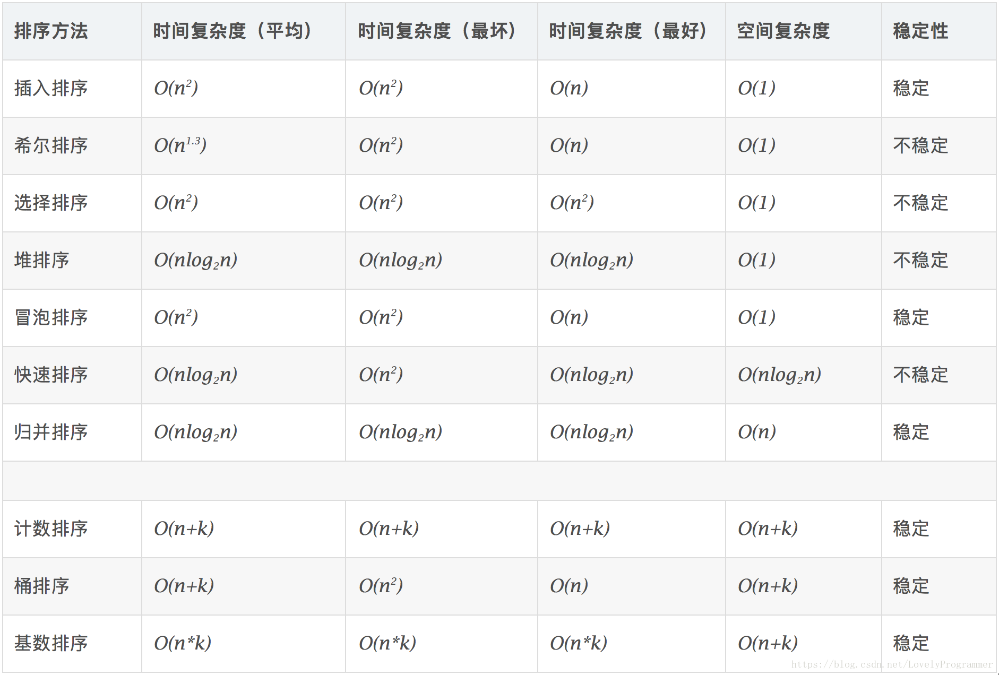

[TOC]

## 1.ListView与RecyclerView的区别

链接： [https://www.jianshu.com/p/f592f3715ae2](https://www.jianshu.com/p/f592f3715ae2)

从以下三点切入：

​      1）布局效果对比

​      2）常用功能与API对比

​      3）在`Android` L引入嵌套滚动机制`（NestedScrolling）`

`ListView`与`RecyclerView`的简单使用：

   **ListView**：

1. 继承重写`BaseAdapter`类； 
2. 自定义`ViewHolder`与`convertView`的优化（判断是否为null）；

   **RecyclerView**：

1. 继承重写`RecyclerView.Adapter`与`RecyclerView.ViewHolder` 

2. 设置`LayoutManager`，以及`layout`的布局效果

   **区别：** 

1. `ViewHolder`的编写规范化，`ListView`是需要自己定义的，而`RecyclerView`是规范好的； 

2. `RecyclerView`复用`item`全部搞定，不需要像`ListView`那样`setTag()`与`getTag()`； 

3. `RecyclerView`多了一些`LayoutManager`工作，但实现了布局效果多样化；

  **布局效果：**

​        `ListView` 的布局比较单一，只有一个纵向效果；

​        `RecyclerView` 的布局效果丰富， 可以在`LayoutMananger`中设置：线性布局（纵向，横向），表格布局，瀑布流布局，在`RecyclerView` 中，如果存在的`LayoutManager`不能满足需求，可以在`LayoutManager`的API中自定义`Layout`： 

​       例如：`scrollToPosition(), setOrientation(), getOrientation(), findViewByPosition()`等等；

  **空数据处理：**

​       在`ListView`中有个`setEmptyView()` 用来处理`Adapter`中数据为空的情况；但是在`RecyclerView`中没有这个API，所以在`RecyclerView`中需要进行一些数据判断来实现数据为空的情况；

 **HeaderView 与 FooterView：**

​        在`ListView`中可以通过`addHeaderView()` 与 `addFooterView()`来添加头部`item`与底部 `item`，当我们需要实现的下拉刷新或者上拉加载的情况；而且这两个API不会影响 `Adapter` 的编写；但是`RecyclerView`中并没有这两个API，所以当我们需要在`RecyclerView`添加头部`item`或者底部 `item` 的时候，我们可以在 `Adapter` 中自己编写，根据 `ViewHolder` 的 `Type` 与 `View` 来实现自己的 `Header，Footter` 与普通的 `item`，但是这样就会影响到 `Adapter` 的数据，比如 `position`，添加了 `Header` 与 `Footter` 后，实际的 `position` 将大于数据的`position`；

​    **局部刷新：**

​       在`ListView`中通常刷新数据是用 `notifyDataSetChanged()`  ，但是这种刷新数据是全局刷新的（每个item的数据都会重新加载一遍），这样一来就会非常消耗资源；`RecyclerView` 中可以实现局部刷新，例如：`notifyItemChanged()`；

​       但是如果要在 `ListView` 实现局部刷新，依然是可以实现的，当一个 `item` 数据刷新时，我们可以在 `Adapter`中，实现一个`onItemChanged()`方法，在方法里面获取到这个 `item` 的 `position`（可以通过`getFirstVisiblePosition()`），然后调用 `getView()` 方法来刷新这个 `item` 的数据；

   **动画效果：**

​        在 `RecyclerView` 中，已经封装好API来实现自己的动画效果；有许多动画API，例如：`notifyItemChanged(), notifyDataInserted(), notifyItemMoved()`等等；如果我们需要实现自己的动画效果，我们可以通过相应的接口实现自定义的动画效果（`RecyclerView.ItemAnimator`类），然后调用`RecyclerView.setItemAnimator()` (默认的有`SimpleItemAnimator与DefaultItemAnimator`)；但是ListView并没有实现动画效果，但我们可以在 `Adapter` 自己实现item的动画效果；

   **ItemTouchHelper**：

​        创建`ItemTouchHelper`实例，然后在`ItemTouchHelper.SimpleCallback()`，然后在`Callback`中实现`getMovementFlags(), onMove(), onSwiped()`， 最后调用`RecyclerView`的`attachToRecyclerView`方法；提供的滑动和删除`Item`的工具类。

   **Item点击事件：**

​          在ListView中有`onItemClickListener(), onItemLongClickListener(), onItemSelectedListener(),` 但是添加HeaderView与FooterView后就不一样了，因为HeaderView与FooterView都会算进position中，这时会发现position会出现变化，可能会抛出数组越界，为了解决这个问题，我们在getItemId()方法（在该方法中HeaderView与FooterView返回的值是-1）中通过返回id来标志对应的item，而不是通过position来标记；但是我们可以在Adapter中针对每个item写在getView()中会比较合适；而在RecyclerView中，提供了唯一一个API：addOnItemTouchListener()，监听item的触摸事件；我们可以通过RecyclerView的addOnItemTouchListener()加上系统提供的Gesture Detector来实现像ListView那样监听某个item某个  操作方法；

​    **嵌套滚动机制：**

​        在事件分发机制中，Touch事件在进行分发的时候，由父View向子View传递，一旦子View消费这个事件的话，那么接下来的事件分发的时候，父View将不接受，由子View进行处理；但是与Android的事件分发机制不同，嵌套滚动机制（Nested Scrolling）可以弥补这个不足，能让子View与父View同时处理这个Touch事件，主要实现在于NestedScrollingChild与NestedScrollingParent这两个接口；而在RecyclerView中，实现的是NestedScrollingChild，所以能实现嵌套滚动机制；

​        ListView就没有实现嵌套滚动机制；

**总结：**

​        这里只是客观的分析ListView与RecyclerView的差异，而在实际场景中，我们应该根据自己的需求来选择使用RecyclerView还是ListView，毕竟，适合业务需求的才是最好的。

## 2.RecyclerView的拖拽怎么实现?

​        ItemTouchHelper是support v7包提供的处理关于在RecyclerView上添加拖动排序与滑动删除的非常强大的工具类。它是RecyclerView.ItemDecoration的子类，也就是说它可以轻易的添加到几乎所有的LayoutManager和Adapter中。见`DefaultItemTouchHelpCallback.java`文件

​       具体说一下`ItemTouchHelper.Callback`这个抽象类：

​    `getMovementFlags()` 

​        用于设置是否处理拖拽事件和滑动事件，以及拖拽和滑动操作的方向，有以下两种情况：

​        如果是列表类型的，拖拽只有`ItemTouchHelper.UP、ItemTouchHelper.DOWN`两个方向

​        如果是网格类型的，拖拽则有`UP、DOWN、LEFT、RIGHT`四个方向

​        另外，滑动方向列表类型的，有START和END两个方法，如果是网格类型的一般不设置支持滑动操作可以将swipeFlags = 0置为0，表示不支持滑动操作！ 

​        最后，需要调用`return makeMovementFlags(dragFlags, swipeFlags)`;将设置的标志位return回去！

​      `onMove()` 

​         如果我们设置了相关的dragFlags ，那么当我们长按item的时候就会进入拖拽并在拖拽过程中不断回调onMove()方法,我们就在这个方法里获取当前拖拽的item和已经被拖拽到所处位置的item的ViewHolder。

​      `onSwipe()` 

​        如果我们设置了相关的swipeFlags，那么当我们滑动item的时候就会调用onSwipe()方法，一般的话在使用LinearLayoutManager的时候，在这个方法里可以删除item，来实现滑动删除！

​        就是说，如果我们不重写这两个方法，那么拖拽和滑动都是默认开启的，如果需要我们自定义拖拽和滑动，可以设置为false，然后调用startDrag()和startSwipe()方法来开启！

  还有两个方法，可以使用户交互更加友好： 

1) `public void onSelectedChanged(RecyclerView.ViewHolder viewHolder, int actionState)`

 这个方法在选中Item的时候（拖拽或者滑动开始的时候）调用，通常这个方法里我们可以改变选中item的背景颜色等，高亮表示选中来提高用户体验。 

 需要注意的是，这里的第二个参数int actionState，它有以下3个值，分别表示3种状态：

ACTION_STATE_IDLE：闲置状态

ACTION_STATE_SWIPE：滑动状态

ACTION_STATE_DRAG：拖拽状态

我们可以根据这个状态值，作不同的逻辑处理！ 

2) `public void clearView(RecyclerView recyclerView, RecyclerView.ViewHolder viewHolder)`

这个方法在当手指松开的时候（拖拽或滑动完成的时候）调用，这时候我们可以将item恢复为原来的状态。

最后在代码中：

```java
ItemTouchHelper itemTouchHelper = new ItemTouchHelper(new SimpleItemTouchCallback(data, adapter));

itemTouchHelper.attachToRecyclerView(recyclerView);
```

## 3.ListView回收机制

链接：[http://www.cnblogs.com/qiengo/p/3628235.html#_Toc383693206](http://www.cnblogs.com/qiengo/p/3628235.html#_Toc383693206)

## 4.MVP和MVVM的区别

链接：[**https://www.cnblogs.com/dubo-/p/5619077.html**](https://www.cnblogs.com/dubo-/p/5619077.html)

​          [**https://blog.csdn.net/victoryzn/article/details/78392128**](https://blog.csdn.net/victoryzn/article/details/78392128)

​         [https://www.jianshu.com/p/ebd2c5914d20](https://www.jianshu.com/p/ebd2c5914d20
)

## 5.HashMap内部实现原理，与HashSet的区别

​       1) HashMap可以接受null键值和值，而HashTable则不能，HashMap是非synchronized的；存储的是键值对。

​       2) HashMap是基于hashing原理,使用put(key,value)存储对象到HashMap中，使用get(key)从HashMap中获取对象，当我们给put方法传递键和值时，我们先对键调用hashCode()方法，返回的hashCode用于找到bucket位置来存储键对象和值对象，作为Map.Entry.

​      3) 如果两个对象hashCode相同：

​       存储时：他们会找到相同的bucket位置，发生碰撞，因为HashMap使用链表存储对象（每个Map.Entry都有一个next指针），这个Entry会存储在链表中。

​       获取时:会用hashCode找到bucket位置，然后调用key.equals()方法找到链表中正确的节点.最终找到要找的值对象.

​       减少碰撞：使用final修饰的对象、或不可变的对象作为键，使用(Integer、String)（是不可变、final的,而且已经重写了equals和hashCode方法）这样的wrapper类作为键是非常好的，（我们可以使用自定义的对象作为键吗？答：当然可以，只要它遵守了equals和hashCode方法定义规则，并且当对象插入到Map中之后将不会再改变。）

​       4) HashMap负载因子默认是0.75，可设置，当map填满了75%的bucket时候，将会创建原来HashMap大小两倍的bucket数组，来重新调整map的大小，并将原来的对象放入新的bucket数组中,这个过程叫做rehashing，因为它调用hash方法找到新的bucket位置。

​       5) 重新调整map大小可能会发生竞争问题：如果两个线程都发现HashMap需要调整大小了，它们都会尝试进行调整，在调整中，存储在链表中的元素的次序会反过来，因为移动bucket位置的时候，HashMap并不会将元素放在链表的尾部，而是放在头部，这是为了避免尾部遍历，如果条件竞争发生了，就死循环了。

Jdk1.7 

<https://www.cnblogs.com/dijia478/p/8006713.html>

jdk1.8

<https://blog.csdn.net/qq_37113604/article/details/81353626>

<https://www.cnblogs.com/little-fly/p/7344285.html>

<https://www.cnblogs.com/tongxuping/p/8276198.html>

## 6.AsyncTask内部实现原理

链接：<https://www.cnblogs.com/absfree/p/5357678.html>

​           https://www.jianshu.com/p/ee1342fcf5e7

### 1) AsyncTask的使用简介

​        AsyncTask是对Handler与线程池的封装。使用它的方便之处在于能够更新用户界面，当然这里更新用户界面的操作还是在主线程中完成的，但是由于AsyncTask内部包含一个Handler，所以可以发送消息给主线程让它更新UI。另外，AsyncTask内还包含了一个线程池。使用线程池的主要原因是避免不必要的创建及销毁线程的开销。设想下面这样一个场景：有100个只需要0.001ms就能执行完毕的任务，如果创建100个线程来执行这些任务，执行完任务的线程就进行销毁。那么创建与销毁进程的开销就很可能成为了影响性能的瓶颈。通过使用线程池，我们可以实现维护固定数量的线程，不管有多少任务，我们都始终让线程池中的线程轮番上阵，这样就避免了不必要的开销。

​       在这里简单介绍下AsyncTask的使用方法，为后文对它的工作原理的研究做铺垫，关于AsyncTask的详细介绍大家可以参考官方文档或是相关博文。

​    AsyncTask是一个抽象类，我们在使用时需要定义一个它的派生类并重写相关方法。AsyncTask类的声明如下：

```java
public abstract class AsyncTask<Params, Progress, Result> 
```

​    我们可以看到，AsyncTask是一个泛型类，它的三个类型参数的含义如下：

- Params：doInBackground方法的参数类型；
- Progress：AsyncTask所执行的后台任务的进度类型；
- Result：后台任务的返回结果类型。

​    我们再来看一下AsyncTask类主要为我们提供了哪些方法：

```java
onPreExecute() //此方法会在后台任务执行前被调用，用于进行一些准备工作
doInBackground(Params... params) //此方法中定义要执行的后台任务，在这个方法中可以调用publishProgress来更新任务进度（publishProgress内部会调用onProgressUpdate方法）
onProgressUpdate(Progress... values) //由publishProgress内部调用，表示任务进度更新
onPostExecute(Result result) //后台任务执行完毕后，此方法会被调用，参数即为后台任务的返回结果
onCancelled() //此方法会在后台任务被取消时被调用
```

​    以上方法中，除了doInBackground方法由AsyncTask内部线程池执行外，其余方法均在主线程中执行。


### 2) AsyncTask的局限性

​        AsyncTask的优点在于执行完后台任务后可以很方便的更新UI，然而使用它存在着诸多的限制。先抛开内存泄漏问题，使用AsyncTask主要存在以下局限性：

- 在Android 4.1版本之前，AsyncTask类必须在主线程中加载，这意味着对AsyncTask类的第一次访问必须发生在主线程中；在Android 4.1以及以上版本则不存在这一限制，因为ActivityThread（代表了主线程）的main方法中会自动加载AsyncTask
- AsyncTask对象必须在主线程中创建
- AsyncTask对象的execute方法必须在主线程中调用
- 一个AsyncTask对象只能调用一次execute方法

​    接下来，我们从源码的角度去探究一下AsyncTask的工作原理，并尝试着搞清楚为什么会存在以上局限性。

### 3) AsyncTask的工作原理

   首先，让我们来看一下AsyncTask类的构造器都做了些什么：

```java
 1 public AsyncTask() {
 2         mWorker = new WorkerRunnable<Params, Result>() {
 3             public Result call() throws Exception {
 4                 mTaskInvoked.set(true);
 5 
 6                 Process.setThreadPriority(Process.THREAD_PRIORITY_BACKGROUND);
 7                 //noinspection unchecked
 8                 Result result = doInBackground(mParams);
 9                 Binder.flushPendingCommands();
10                 return postResult(result);
11             }
12         };
13 
14         mFuture = new FutureTask<Result>(mWorker) {
15             @Override
16             protected void done() {
17                 try {
18                     postResultIfNotInvoked(get());
19                 } catch (InterruptedException e) {
20                     android.util.Log.w(LOG_TAG, e);
21                 } catch (ExecutionException e) {
22                     throw new RuntimeException("An error occurred while executing doInBackground()",
23                             e.getCause());
24                 } catch (CancellationException e) {
25                     postResultIfNotInvoked(null);
26                 }
27             }
28         };
29     }
```

​        在第2行到第12行，初始化了mWorker，它是一个派生自WorkRunnable类的对象。WorkRunnable是一个抽象类，它实现了Callable<Result>接口。我们再来看一下第4行开始的call方法的定义，首先将mTaskInvoked设为true表示当前任务已被调用过，然后在第6行设置线程的优先级。在第8行我们可以看到，调用了AsyncTask对象的doInBackground方法开始执行我们所定义的后台任务，并获取返回结果存入result中。最后将任务返回结果传递给postResult方法。关于postResult方法我们会在下文进行分析。由此我们可以知道，实际上AsyncTask的成员mWorker包含了AyncTask最终要执行的任务（即mWorker的call方法）。

​       接下来让我们看看对mFuture的初始化。我们可以看到mFuture是一个FutureTask的直接子类（匿名内部类）的对象，在FutureTask的构造方法中我们传入了mWorker作为参数。我们使用的是FutureTask的这个构造方法：

```java
    public FutureTask(Callable<V> callable) {
        if (callable == null)
            throw new NullPointerException();
        this.callable = callable;
        this.state = NEW;       // ensure visibility of callable
    }
```

​       也就是说，mFuture是一个封装了我们的后台任务的FutureTask对象，FutureTask类实现了FutureRunnable接口，通过这个接口可以方便的取消后台任务以及获取后台任务的执行结果，具体介绍请看这里：[Java并发编程：Callable、Future和FutureTask](http://www.cnblogs.com/dolphin0520/p/3949310.html)。

​        从上面的分析我们知道了，当mWorker中定义的call方法被执行时，doInBackground就会开始执行，我们定义的后台任务也就真正开始了。那么这个call方法什么时候会被调用呢？我们可以看到经过层层封装，实际上是mFuture对象封装了call方法，当mFuture对象被提交到AsyncTask包含的线程池执行时，call方法就会被调用，我们定义的后台任务也就开始执行了。下面我们来看一下mFuture是什么时候被提交到线程池执行的。

​       首先来看一下execute方法的源码：

```java
 public final AsyncTask<Params, Progress, Result> execute(Params... params) {
        return executeOnExecutor(sDefaultExecutor, params);
}
```

​        我们可以看到它接收的参数是Params类型的参数，这个参数会一路传递到doInBackground方法中。execute方法仅仅是调用了executeOnExecutor方法，并将executeOnExecutor方法的返回值作为自己的返回值。我们注意到，传入了sDefaultExecutor作为executeOnExecutor方法的参数，那么sDefaultExecutor是什么呢？简单的说，它是AsyncTask的默认执行器（线程池）。AsyncTask可以以串行（一个接一个的执行）或并行（一并执行）两种方式来执行后台任务，在Android3.0及以后的版本中，默认的执行方式是串行。这个sDefaultExecutor就代表了默认的串行执行器（线程池）。也就是说我们平常在AsyncTask对象上调用execute方法，使用的是串行方式来执行后台任务。关于线程池更加详细的介绍与分析请见：[深入理解Java之线程池](http://www.cnblogs.com/absfree/p/5357118.html)

​    我们再来看一下executeOnExecutor方法都做了些什么：

```java
 1 public final AsyncTask<Params, Progress, Result> executeOnExecutor(Executor exec,
 2             Params... params) {
 3         if (mStatus != Status.PENDING) {
 4             switch (mStatus) {
 5                 case RUNNING:
 6                     throw new IllegalStateException("Cannot execute task:"
 7                             + " the task is already running.");
 8                 case FINISHED:
 9                     throw new IllegalStateException("Cannot execute task:"
10                             + " the task has already been executed "
11                             + "(a task can be executed only once)");
12             }
13         }
14 
15         mStatus = Status.RUNNING;
16 
17         onPreExecute();
18 
19         mWorker.mParams = params;
20         exec.execute(mFuture);
21 
22         return this;
23     }
```

​       从以上代码的第4行到第12行我们可以知道，当AsyncTask对象的当前状态为RUNNING或FINISHED时，调用execute方法会抛出异常，这意味着不能对正在执行任务的AsyncTask对象或是已经执行完任务的AsyncTask对象调用execute方法，这也就解释了我们上面提到的局限中的最后一条。

​       接着我们看到第17行存在一个对onPreExecute方法的调用，这表示了在执行后台任务前确实会调用onPreExecute方法。

​       在第19行，把我们传入的execute方法的params参数赋值给了mWorker的mParams成员变量；而后在第20行调用了exec的execute方法，并传入了mFuture作为参数。exec就是我们传进来的sDefaultExecutor。那么接下来我们看看sDefaultExecutor究竟是什么。在AsyncTask类的源码中，我们可以看到这句：

```java
private static volatile Executor sDefaultExecutor = SERIAL_EXECUTOR;
```

​     sDefaultExecutor被赋值为SERIAL_EXECUTOR，那么我们来看一下SERIAL_EXECUTOR：

```java
public static final Executor SERIAL_EXECUTOR = new SerialExecutor();
```

​        现在，我们知道了实际上sDefaultExecutor是一个SerialExecutor对象，我们来看一下SerialExecutor类的源码：

```java
 1 private static class SerialExecutor implements Executor {
 2         final ArrayDeque<Runnable> mTasks = new ArrayDeque<Runnable>();
 3         Runnable mActive;
 4 
 5         public synchronized void execute(final Runnable r) {
 6             mTasks.offer(new Runnable() {
 7                 public void run() {
 8                     try {
 9                         r.run();
10                     } finally {
11                         scheduleNext();
12                     }
13                 }
14             });
15             if (mActive == null) {
16                 scheduleNext();
17             }
18         }
19 
20         protected synchronized void scheduleNext() {
21             if ((mActive = mTasks.poll()) != null) {
22                 THREAD_POOL_EXECUTOR.execute(mActive);
23             }
24         }
25     }
```

​         我们来看一下execute方法的实现。mTasks代表了SerialExecutor这个串行线程池的任务缓存队列，在第6行，我们用offer方法向任务缓存队列中添加一个任务，任务的内容如第7行到第13行的run方法定义所示。我们可以看到，run方法中：第9行调用了mFuture（第5行的参数r就是我们传入的mFuture）的run方法，而mFuture的run方法内部会调用mWorker的call方法，然后就会调用doInBackground方法，我们的后台任务也就开始执行了。那么我们提交到任务缓存队列中的任务什么时候会被执行呢？我们接着往下看。

​        首先我们看到第三行定义了一个Runnable变量mActive，它代表了当前正在执行的AsyncTask对象。第15行判断mActive是否为null，若为null，就调用scheduleNext方法。如第20行到24行所示，在scheduleNext方法中，若缓存队列非空，则调用THREAD_POOL_EXECUTOR.execute方法执行从缓存队列中取出的任务，这时我们的后台任务便开始你真正执行了。

​     通过以上的分析，我们可以知道SerialExecutor所完成的工作主要是把任务加到任务缓存队列中，而真正执行任务的是THREAD_POOL_EXECUTOR。我们来看下THREAD_POOL_EXECUTOR是什么：

```java
 public static final Executor THREAD_POOL_EXECUTOR
            = new ThreadPoolExecutor(CORE_POOL_SIZE, MAXIMUM_POOL_SIZE, KEEP_ALIVE,
                    TimeUnit.SECONDS, sPoolWorkQueue, sThreadFactory);
```

​    从上面的代码我们可以知道，它是一个线程池对象。根据AsyncTask的源码，我们可以获取它的各项参数如下：

```java
 1 private static final int CPU_COUNT = Runtime.getRuntime().availableProcessors();
 2 private static final int CORE_POOL_SIZE = CPU_COUNT + 1;
 3 private static final int MAXIMUM_POOL_SIZE = CPU_COUNT * 2 + 1;
 4 private static final int KEEP_ALIVE = 1;
 5 
 6 private static final ThreadFactory sThreadFactory = new ThreadFactory() {
 7     private final AtomicInteger mCount = new AtomicInteger(1);
 8 
 9     public Thread newThread(Runnable r) {
10         return new Thread(r, "AsyncTask #" + mCount.getAndIncrement());
11     }
12 };
13 
14 private static final BlockingQueue<Runnable> sPoolWorkQueue =
15             new LinkedBlockingQueue<Runnable>(128);
```

​     由以上代码我们可以知道：

-  CORE_POOL_SIZE为CPU数加一；
- MAXIMUM_POOL_SIZE为CPU数的二倍加一；
- 存活时间为1秒；
- 任务缓存队列为LinkedBlockingQueue。

​        现在，我们已经了解到了从我们调用AsyncTask对象的execute方法开始知道后台任务执行完都发生了什么。现在让我们回过头来看一看之前提到的postResult方法的源码：

```java
private Result postResult(Result result) {
    @SuppressWarnings("unchecked")
    Message message = getHandler().obtainMessage(MESSAGE_POST_RESULT,
            new AsyncTaskResult<Result>(this, result));
    message.sendToTarget();
    return result;
}
```

​         在以上源码中，先调用了getHandler方法获取AsyncTask对象内部包含的sHandler，然后通过它发送了一个MESSAGE_POST_RESULT消息。我们来看看sHandler的相关代码：

```java
 1 private static final InternalHandler sHandler = new InternalHandler();
 2 
 3 private static class InternalHandler extends Handler {
 4         public InternalHandler() {
 5             super(Looper.getMainLooper());
 6         }
 7 
 8         @SuppressWarnings({"unchecked", "RawUseOfParameterizedType"})
 9         @Override
10         public void handleMessage(Message msg) {
11             AsyncTaskResult<?> result = (AsyncTaskResult<?>) msg.obj;
12             switch (msg.what) {
13                 case MESSAGE_POST_RESULT:
14                     // There is only one result
15                     result.mTask.finish(result.mData[0]);
16                     break;
17                 case MESSAGE_POST_PROGRESS:
18                     result.mTask.onProgressUpdate(result.mData);
19                     break;
20             }
21         }
22 } 
```

​         从以上代码中我们可以看到，sHandler是一个静态的Handler对象。我们知道创建Handler对象时需要当前线程的Looper，所以我们为了以后能够通过sHandler将执行环境从后台线程切换到主线程（即在主线程中执行handleMessage方法），我们必须使用主线程的Looper，因此必须在主线程中创建sHandler。这也就解释了为什么必须在主线程中加载AsyncTask类，是为了完成sHandler这个静态成员的初始化工作。

​       在以上代码第10行开始的handleMessage方法中，我们可以看到，当sHandler收到MESSAGE_POST_RESULT方法后，会调用finish方法，finish方法的源码如下：

```java
1 private void finish(Result result) {
2         if (isCancelled()) {
3             onCancelled(result);
4         } else {
5             onPostExecute(result);
6         }
7         mStatus = Status.FINISHED;
8 }
```

​        在第2行，会通过调用isCancelled方法判断AsyncTask任务是否被取消，若取消了则调用onCancelled方法，否则调用onPostExecute方法；在第7行，把mStatus设为FINISHED，表示当前AsyncTask对象已经执行完毕。

​        经过了以上的分析，我们大概了解了AsyncTask的内部运行逻辑，知道了它默认使用串行方式执行任务。那么如何让它以并行的方式执行任务呢？ 阅读了以上的代码后，我们不难得到结论，只需调用executeOnExecutor方法，并传入THREAD_POOL_EXECUTOR作为其线程池即可。

**优点：**

1.方便异步通信，不需使用 “任务线程（如继承`Thread`类） + `Handler`”的复杂组合。

2.节省资源，采用线程池的缓存线程 + 复用线程，避免了频繁创建 & 销毁线程所带来的系统资源开销。

### 4) AsyncTask各个方法的作用


## 7.Java多线程

### 1) 并发与并行

​       我们知道，在单核机器上，“多进程”并不是真正的多个进程在同时执行，而是通过CPU时间分片，操作系统快速在进程间切换而模拟出来的多进程。我们通常把这种情况成为并发，也就是多个进程的运行行为是“一并发生”的，但不是同时执行的，因为CPU核数的限制（PC和通用寄存器只有一套，严格来说在同一时刻只能存在一个进程的上下文）。

​        现在，我们使用的计算机基本上都搭载了多核CPU，这时，我们能真正的实现多个进程并行执行，这种情况叫做并行，因为多个进程是真正“一并执行”的（具体多少个进程可以并行执行取决于CPU核数）。综合以上，我们知道，并发是一个比并行更加宽泛的概念。也就是说，在单核情况下，并发只是并发；而在多核的情况下，并发就变为了并行。下文中我们将统一用并发来指代这一概念。

### 2) 阻塞与非阻塞

​    UNIX系统内核提供了一个名为read的函数，用来读取文件的内容：

```java
typedef ssize_t int;
typedef size_t unsigned;

ssize_t read(int fd, void *buf, size_t n);
```

​        这个函数从描述符为fd的当前文件位置复制至多n个字节到内存缓冲区buf。若执行成功则返回读取到的字节数；若失败则返回-1。read系统调用默认会

​        阻塞，也就是说系统会一直等待这个函数执行完毕直到它产生一个返回值。然而我们知道，磁盘通常是一种慢速I/O设备，这意味着我们用read函数读取磁盘文件内容时，往往需要比较长的时间（相对于访问内存或者计算一些数值来说）。那么阻塞的时候我们当然不想让系统傻等着，我们想在这期间做点儿别的事情，等着磁盘准备好了通知我们一下，我们再来读取文件内容。实际上，操作系统正是这样做的。当阻塞在read这类系统调用中的时候，操作系统通常都会让该进程暂时休眠，调度一个别的进程来执行，以免干等着浪费时间，等到磁盘准备好了可以让我们来进行I/O了，它会发送一个中断信号通知操作系统，这时候操作系统重新调度原来的进程来继续执行read函数。这就是通过多进程实现的并发。

### 3) 多进程 vs 多线程

​        进程就是一个执行中的程序实例，而线程可以看作一个进程的最小执行单元。线程与进程间的一个显著区别在于每个进程都有一整套变量，而同一个进程间的多个线程共享该进程的数据。多进程实现的并发通常在进程创建以及数据共享等方面的开销要比多线程更大，线程的实现通常更加轻量，相应的开销也就更小，因此在一般客户端开发场景下，我们更加倾向于使用多线程来实现并发。

​         然而，有时候，多线程共享数据的便捷容易可能会成为一个让我们头疼的问题，我们在后文中会具体提到常见的问题及相应的解决方案。在上面的read函数的例子中，如果我们使用多线程，可以使用一个主线程去进行I/O的工作，再用一个或几个工作线程去执行一些轻量计算任务，这样当主线程阻塞时，线程调度程序会调度我们的工作线程来执行计算任务，从而更加充分的利用CPU时间片。而且，在多核机器上，我们的多个线程可以并行执行在多个核上，进一步提升效率。

### 4) 线程执行模型

​        每个进程刚被创建时都只含有一个线程，这个线程通常被称作主线程（main thread）。而后随着进程的执行，若遇到创建新线程的代码，就会创建出新线程，而后随着新线程被启动，多个线程就会并发地运行。某时刻，主线程阻塞在一个慢速系统调用中（比如前面提到的read函数），这时线程调度程序会让主线程暂时休眠， 调度另一个线程来作为当前运行的线程。每个线程也有自己的一套变量，但相比于进程来说要少得多，因此线程切换的开销更小。

### 5) 创建一个新线程

#### （1）通过实现Runnable接口    

​        在Java中，有两种方法可以创建一个新线程。第一种方法是定义一个实现Runnable接口的类并实例化，然后将这个对象传入Thread的构造器来创建一个新线程，如以下代码所示：

```java
class MyRunnable implements Runnable {
     ...
    public void run() {
         //这里是新线程需要执行的任务
    }
}
 
Runnable r = new MyRunnable();
Thread t = new Thread(r);
```

#### （2）通过继承Thread类    

​        第二种创建一个新线程的方法是直接定义一个Thread的子类并实例化，从而创建一个新线程。比如以下代码：

```java
class MyThread extends Thread {
    public void run() {
        //这里是线程要执行的任务
    }
}
```

​       创建了一个线程对象后，我们直接对其调用start方法即可启动这个线程：

```java
t.start();
```

#### （3）两种方式的比较    

​        既然有两种方式可以创建线程，那么我们该使用哪一种呢？首先，直接继承Thread类的方法看起来更加方便，但它存在一个局限性：由于Java中不允许多继承，我们自定义的类继承了Thread后便不能再继承其他类，这在有些场景下会很不方便；实现Runnable接口的那个方法虽然稍微繁琐些，但是它的优点在于自定义的类可以继承其他的类。

### 6) 线程的属性

#### （1）线程的状态

​    线程在它的生命周期中可能处于以下几种状态之一：

- New（新生）：线程对象刚刚被创建出来；
- Runnable（可运行）：在线程对象上调用start方法后，相应线程便会进入Runnable状态，若被线程调度程序调度，这个线程便会成为当前运行（Running）的线程；
- Blocked（被阻塞）：若一段代码被线程A”上锁“，此时线程B尝试执行这段代码，线程B就会进入Blocked状态；
- Waiting（等待）：当线程等待另一个线程通知线程调度器一个条件时，它本身就会进入Waiting状态；
- Time Waiting（计时等待）：计时等待与等待的区别是，线程只等待一定的时间，若超时则不再等待；
- Terminated（被终止）：线程的run方法执行完毕或者由于一个未捕获的异常导致run方法意外终止会进入Terminated状态。

​    **后文中若不加特殊说明的话，我们会用阻塞状态统一指代Blocked、Waiting、Time Waiting。**    

#### （2）线程的优先级

​        在Java中，每个线程都有一个优先级，默认情况下，线程会继承它的父线程的优先级。可以用setPriority方法来改变线程的优先级。Java中定义了三个描述线程优先级的常量：MAX_PRIORITY、NORM_PRIORITY、MIN_PRIORITY。

​        每当线程调度器要调度一个新的线程时，它会首先选择优先级较高的线程。然而线程优先级是高度依赖与操作系统的，在有些系统的Java虚拟机中，甚至会忽略线程的优先级。因此我们不应该将程序逻辑的正确性依赖于优先级。线程优先级相关的API如下：

```java
void setPriority(int newPriority) //设置线程的优先级，可以使用系统提供的三个优先级常量
static void yield() //使当前线程处于让步状态，这样当存在其他优先级大于等于本线程的线程时，线程调度程序会调用那个线程
```

### 7) Thread类

​    Thread实现了Runnable接口，关于这个类的以下实例需要我们了解：

```java
private volatile char  name[]; //当前线程的名字，可在构造器中指定
private int priority; //当前线程优先级
private Runnable target; //当前要执行的任务
private long tid; //当前线程的ID
```

​    Thread类的常用方法除了我们之前提到的用于启动线程的start外还有：

- **sleep方法**，这是一个静态方法，作用是让当前线程进入休眠状态（但线程不会释放已获取的锁），这个休眠状态其实就是我们上面提到过的Time Waiting状态，从休眠状态“苏醒”后，线程会进入到Runnable状态。sleep方法有两个重载版本，声明分别如下：

```java
public static native void sleep(long millis) throws InterruptedException; //让当前线程休眠millis指定的毫秒数
public static native void sleep(long millis, int nanos) throws InterruptedException; //在毫秒数的基础上还指定了纳秒数，控制粒度更加精细
```

-  **join方法**，这是一个实例方法，在当前线程中对一个线程对象调用join方法会导致当前线程停止运行，等那个线程运行完毕后再接着运行当前线程。也就是说，把当前线程还没执行的部分“接到”另一个线程后面去，另一个线程运行完毕后，当前线程再接着运行。join方法有以下重载版本：

```java
public final synchronized void join() throws InterruptedException 
public final synchronized void join(long millis) throws InterruptedException; 
public final synchronized void join(long millis, int nanos) throws InterruptedException;
```

​         无参数的join表示当前线程一直等到另一个线程运行完毕，这种情况下当前线程会处于Wating状态；带参数的表示当前线程只等待指定的时间，这种情况下当前线程会处于Time Waiting状态。**当前线程通过调用join方法进入Time Waiting或Waiting状态后，会释放已经获取的锁。**实际上，join方法内部调用了Object类的实例方法wait，关于这个方法我们下面会具体介绍。

- **yield方法**，这是一个静态方法，作用是让当前线程“让步”，目的是为了让优先级不低于当前线程的线程有机会运行，**这个方法不会释放锁。**

- **interrupt方法**，这是一个实例方法。每个线程都有一个中断状态标识，这个方法的作用就是将相应线程的中断状态标记为true，这样相应的线程调用isInterrupted方法就会返回true。**通过使用这个方法，能够终止那些通过调用可中断方法进入阻塞状态的线程。**常见的可中断方法有sleep、wait、join，这些方法的内部实现会时不时的检查当前线程的中断状态，若为true会立刻抛出一个InterruptedException异常，从而终止当前线程。

​     以下这幅图很好的诠释了随着各种方法的调用，线程在不同的状态之间的切换（图片来源：<http://www.cnblogs.com/dolphin0520/p/3920357.html>）：


### 8) wait方法与notify/notifyAll方法

#### （1）wait方法

​        wait方法是Object类中定义的实例方法。在指定对象上调用wait方法能够让当前线程进入阻塞状态（前提时当前线程持有该对象的内部锁（monitor）），此时当前线程会释放已经获取的那个对象的内部锁，这样一来其他线程就可以获取这个对象的内部锁了。当其他线程获取了这个对象的内部锁，进行了一些操作后可以调用notify方法来唤醒正在等待该对象的线程。

#### （2）notify/notifyAll方法

​        notify/notifyAll方法也是Object类中定义的实例方法。它俩的作用是唤醒正在等待相应对象的线程，区别在于前者唤醒一个等待该对象的线程，而后者唤醒所有等待该对象的线程。这么说比较抽象，下面我们来举一个具体的例子来说明以下wait和notify/notifyAll的用法。请看以下代码（转自[Java并发编程：线程间协作的两种方式](http://www.cnblogs.com/dolphin0520/p/3920385.html))：

```java
 1 public class Test {
 2     private int queueSize = 10;
 3     private PriorityQueue<Integer> queue = new PriorityQueue<Integer>(queueSize);
 4       
 5     public static void main(String[] args)  {
 6         Test test = new Test();
 7         Producer producer = test.new Producer();
 8         Consumer consumer = test.new Consumer();
 9           
10         producer.start();
11         consumer.start();
12     }
13       
14     class Consumer extends Thread{
15           
16         @Override
17         public void run() {
18             consume();
19         }
20           
21         private void consume() {
22             while(true){
23                 synchronized (queue) {
24                     while(queue.size() == 0){
25                         try {
26                             System.out.println("队列空，等待数据");
27                             queue.wait();
28                         } catch (InterruptedException e) {
29                             e.printStackTrace();
30                             queue.notify();
31                         }
32                     }
33                     queue.poll();          //每次移走队首元素
34                     queue.notify();
35                     System.out.println("从队列取走一个元素，队列剩余"+queue.size()+"个元素");
36                 }
37             }
38         }
39     }
40       
41     class Producer extends Thread{
42           
43         @Override
44         public void run() {
45             produce();
46         }
47           
48         private void produce() {
49             while(true){
50                 synchronized (queue) {
51                     while(queue.size() == queueSize){
52                         try {
53                             System.out.println("队列满，等待有空余空间");
54                             queue.wait();
55                         } catch (InterruptedException e) {
56                             e.printStackTrace();
57                             queue.notify();
58                         }
59                     }
60                     queue.offer(1);        //每次插入一个元素
61                     queue.notify();
62                     System.out.println("向队列取中插入一个元素，队列剩余空间："+(queueSize-queue.size()));
63                 }
64             }
65         }
66     }
67 }
```

​        以上代码描述的是经典的“生产者-消费者”问题。Consumer类代表消费者，Producer类代表生产者。在生产者进行生产之前（对应第48行的produce方法），会获取queue的内部锁（monitor）。然后判断队列是否已满，若满了则无法再生产，所以在第54行调用queue.wait方法，从而等待在queue对象上。（释放了queue的内部锁）此时生产者能够能够获取queue的monitor从而进入第21行的consume方法，这样一来它就会通过第33行的queue.poll方法进行消费，于是队列不再满了，接着它在第34行调用queue.notify方法来通知正在等待的生产者，生产者就会从刚才阻塞的wait方法（第54行）中返回。

​       同理，当队列空时，消费者也会等待（第27行）生产者来唤醒（第61行）。

​       await方法和signal/signalAll方法是wait方法和notify/notifyAll方法的升级版，在后文中会具体介绍它们与wait、notify/notifyAll之间的关系。

### 9) 如何保证线程安全

​       所谓线程安全，指的是当多个线程并发访问数据对象时，不会造成对数据对象的“破坏”。保证线程安全的一个基本思路就是让访问同一个数据对象的多个线程进行“排队”，一个接一个的来，这样就不会对数据造成破坏，但带来的代价是降低了并发性。

#### （1）race condition（竟争条件）

​        当两个或两个以上的线程同时修改同一数据对象时，可能会产生不正确的结果，我们称这个时候存在一个**竞争条件（race condition）**。在多线程程序中，我们必须要充分考虑到多个线程同时访问一个数据时可能出现的各种情况，确保对数据进行同步存取，以防止错误结果的产生。请考虑以下代码：

```java
public class Counter {
    private long count = 0;
    public void add(long value) {
        this.count = this.count + value;  
    }
} 
```

​    我们注意一下改变count值的那一行，通常这个操作不是一步完成的，它大概分为以下三步：

- 第一步，把count的值加载到寄存器中；
- 第二步，把相应寄存器的值加上value的值；
- 第三步，把寄存器的值写回count变量。

​    我们可以编译以上代码然后用javap查看下编译器为我们生成的字节码：


​          我们可以看到，大致过程和我们以上描述的基本一样。那么我们考虑下面这样一个场景：假设count的初值为0，首先线程A加载了count到寄存器中，并且加上了1，而就当它要写回之前，线程B进入了add方法，它加载了count到寄存器中（由于此时线程A还没有把count写回，因此count还是0），并加上了2，然后线程B写回了count。在线程B完成了写回后，线程调度程序调度了线程A，线程A也写回了count。注意，此时count的值为1而不是我们希望的三。我们不希望一个线程在执行add方法时被其他线程打断，因为这会造成数据的破坏。我们希望的情况是这样的：线程A完整执行完毕add方法后，待count变量的值更新为1时，线程B开始执行add方法，在线程B完整执行完毕之前， 没有别的线程能够打断它，若有别的线程想调用add，也得等线程B执行完毕写回count值后。

​        像add这种方法代码所在的内存区，我们称之为临界区（critical area）。对于临界区，在同一时刻我们只希望有一个线程能够访问它，我们希望在一个线程进入临界区后把通往这个区的门“上锁”，离开后把门"解锁“，这样当一个线程执行临界区的代码时其他想要进来的线程只能在门外等着，这样可以保证了多个线程共享的数据不会被破坏。下面我们来介绍下为临界区“上锁”的方法。

#### （2）锁对象

​        Java类库中为我们提供了能够给临界区“上锁”的ReentrantLock类，它实现了Lock接口，在进一步介绍ReentrantLock类之前，我们先来看一下Lock接口的定义：

```java
public interface Lock {
    void lock();
    void lockInterruptibly() throws InterruptedException;
    boolean tryLock();
    boolean tryLock(long time, TimeUnit unit) throws InterruptedException;
    void unlock();
    Condition newCondition();
}
```

   我们来分别介绍下Lock接口中发方法：

- lock方法用来获取锁，在锁被占用时它会一直阻塞，并且这个方法不能被中断；
- lockInterruptibly方法在获取不到锁时也会阻塞，它与lock方法的区别在于阻塞在该方法时可以被中断；
- tryLock方法也是用来获取锁的，它的无参版本在获取不到锁时会立刻返回false，它的计时等待版本会在等待指定时间还获取不到锁时返回false，计时等待的tryLock在阻塞期间也能够被中断。使用tryLock方法的典型代码如下：

```java
if (myLock.tryLock()) {
    try {
        …
    } finally {
        myLock.unlock();
    }
} else {
    //做其他的工作
} 
```

- unlock方法用来释放锁；
- newCondition方法用来获取当前锁对象相关的条件对象，这个在下文我们会具体介绍。

​         ReentrantLock类是唯一一个Lock接口的实现类，它的意思是可重入锁，关于“可重入”的概念我们下面会进行介绍。有了上面的介绍，理解它的使用方法就很简单了，比如下面的代码即完成了给add方法“上锁”：

```java
Lock myLock = new ReentrantLock();
public void add(long value) {
    myLock.lock();
    try {
        this.count = this.count + value;
    } finally {
        myLock.unlock();
    }
}
```

​         从以上代码可以看到，使用ReentrantLock对象来上锁时只需要先获取一个它的实例。然后通过lock方法进行上锁，通过unlock方法进行解锁。注意，我们使用了一个try-finally块，以确保即使发生异常也总是会解锁，不然其他线程会一直无法执行add方法。当一个线程执行完“myLock.lock()”时，它就获得了一个锁对象，这就相当于它给临界区上了锁，其他线程都无法进来，只有这个线程执行完“myLock.unlock()"时，释放了锁对象，其他线程才能再通过“myLock.lock()"获得锁对象，从而进入临界区。也就是说，当一个线程获取了锁对象后，其他尝试获取锁对象的线程都会被阻塞，进入Blocked状态，直至获取锁对象的线程释放了锁对象。

​        有了锁对象，尽管线程A在执行add方法的过程中被线程调度程序剥夺了运行权，其他的线程也进入不了临界区，因为线程A还在持有锁对象。这样一来，我们就很好的保护了临界区。

​        ReentrantLock锁是**可重入的**，这意味着线程可以重复获得已经持有的锁，每个锁对象内部都持有一个计数，每当线程获取依次锁对象，这个计数就加1，释放一次就减1。只有当计数值变为0时，才意味着这个线程释放了锁对象，这时其他线程才可以来获取。

#### （3）条件对象

​        有些时候，线程进入临界区后不能立即执行，它需要等某一条件满足后才开始执行。比如，我们希望count值大于5的时候才增加它的值，我们最先想到的是加个条件判断：

```java
public void add(int value) {    
    if (this.count > 5) {
        this.count = this.count + value;
    }
}
```

​        然而上面的代码存在一个问题。假设线程A执行完了条件判断并的值count值大于5，而在此时该线程被线程调度程序中断执行，转而调度线程B，线程B对统一counter对象的count值进行了修改，使得它不再大于5，这时线程调度程序又来调度线程A，线程A刚才判定了条件为真，所以会执行add方法，尽管此时count值已不再大于5。显然，这与我们所希望的情况的不符的。对于这种问题，我们想到了可以在条件判断前后加锁与解锁：

```java
public void add(int value) {
    myLock.lock();
    try {
        while (counter.getCount() <= 5) {
            //等待直到大于5
        }
        this.count = this.count + value;
    } finally {
        myLock.unlock();
    }
}
```

​       在以上代码中，若线程A发现count值小于等于5，它会一直等到别的线程增加它的值直到它大于5。然而线程A此时持有锁对象，其他线程无法进入临界区（add方法内部）来改变count的值，所以当线程A进入临界区时若count小于等于5，线程A会一直在循环中等待，其他的线程也无法进入临界区。这种情况下，**我们可以使用条件对象来管理那些已经获得了一个锁却不能开始干活的线程**。一个锁对象可以有一个或多个相关的条件对象，在锁对象上调用 `newCondition` 方法就可以获得一个条件对象。比如我们可以为“count值大于5”获得一个条件对象：

```java
Condition enoughCount = myLock.newCondition();
```

​        然后，线程A发现count值不够时，调用“enoughCount.await()”即可，这时它便会进入Waiting状态，放弃它持有的锁对象，以便其他线程能够进入临界区。当线程B进入临界区修改了count值后，发现了count值大于5，线程B可通过"enoughCount.signalAll()"来“唤醒所有等待这一条件满足的线程（这里只有线程A）。此时线程A会从Waiting状态进入Runnable状态。当线程A再次被调度时，它便会从await方法返回，重新获得锁并接着刚才继续执行。注意，此时线程A会再次测试条件是否满足，若满足则执行相应操作。也就是说signalAll方法仅仅是通知线程A一声count的值可能大于5了，应该再测试一下。还有一个signal方法，会随机唤醒一个正在等待某条件的线程，这个方法的风险在于若随机唤醒的线程测试条件后发现仍然不满足，它还是会再次进入Waiting状态，若以后不再有线程唤醒它，它便不能再运行了。

#### （4）synchronized关键字

​         Java中的每个对象都有一个内部锁，这个内部锁也被称为**监视器（monitor）**；每个类内部也有一个锁，用于控制多个线程对其静态成员的并发访问。若一个实例方法用synchronized关键字修饰，那么这个对象的内部锁会“保护”此方法，我们称此方法为同步方法。这意味着只有获取了该对象内部锁的线程才能够执行此方法。也就是说，以下的代码：

```java
public synchronized void add(int value) {
    ...
}
```

等价于：

```java
public void add(int value) {
    this.innerLock.lock();
    try {
        ...
    } finally {
        this.innerLock.unlock();
    }
}
```

​        这意味着，我们通过给add方法加上synchronized关键字即可保护它，加锁解锁的工作不需要我们再手动完成。对象的内部锁在同一时刻只能由一个线程持有，其他尝试获取的线程都会被阻塞直至该线程释放锁，

这种情况下被阻塞的线程无法被中断。

​        内部锁对象只有一个相关条件。**wait方法添加一个线程到这个条件的等待集中**；**notifyAll / notify方法会唤醒等待集中的线程。**也就是说wait() / notify()等价于enoughCount.await() / enoughCount.signAll()。以上add方法我们可以这么实现：

```java
public synchronized void add(int value) {
    while (this.count <= 5) {
        wait(); 
    }
    this.count += value;
    notifyAll();
}
```

​      这份代码显然比我们上面的实现要简洁得多，实际开发中也更加常用。

​      我们也可以用synchronized关键字修饰静态方法，这样的话，进入该方法的线程或获取相关类的Class对象的内部锁。例如，若Counter中含有一个synchronized关键字修饰的静态方法，那么进入该方法的线程会获得Bank.class的内部锁。这意味着其他任何线程不能执行Counter类的任何同步静态方法。

​        对象内部锁存在一些局限性：

- **不能中断一个正在试图获取锁的线程；**
- **试图获取锁时不能设定超时；**
- **每个锁仅有一个相关条件；**

​        那么我们究竟应该使用Lock/Condition还是synchronized关键字呢？答案是能不用尽量都不用，我们应尽可能使用java.util.concurrent包中提供给我们的相应机制（后面会介绍）。

​        当我们要在synchronized关键字与Lock间做出选择时我们需要考虑以下几点：

- 若我们需要多个线程进行读操作，应该使用实现了Lock接口的ReentrantReadWriteLock类，这个类允许多个线程同时读一个数据对象（这个类的使用后面会介绍）；
- 当我们需要Lock/Condition的特性时，应该考虑使用它（比如多个条件还有计时等待版本的await函数）；
- 一般场景我们可以考虑使用synchronized关键字，因为它的简洁性一定程度上能够减少出错的可能。关于synchronized关键字需要注意的一点是：**synchronized方法或者synchronized代码块出现异常时，Java虚拟机会自动释放当前线程已获取的锁。**

#### （5）同步阻塞

​       上面我们提到了一个线程调用synchronized方法可以获得对象的内部锁（前提是还未被其他线程获取），获得对象内部锁的另一种方法就是通过同步阻塞：

```java
synchronized (obj) {
    //临界区
}
```

​      一个线程执行上面的代码块便可以获取obj对象的内部锁，直至它离开这个代码块才会释放锁。

​      我们经常会看到一种特殊的锁，如下所示：

```java
public class Counter {
    private Object lock = new Object();

    synchronized (lock) {
        //临界区
    }
    ...
}
```

​         那么这种使用这种锁有什么好处呢？我们知道Counter对象只有一个内部锁，这个内部锁在同一时刻只能被一个对象持有，那么设想Counter对象中定义了两个synchronized方法。在某一时刻，线程A进入了其中一个synchronized方法并获取了内部锁，此时线程B尝试进去另一个synchronized方法时由于对象内部锁还没有被线程A释放，因此线程B只能被阻塞。然而我们的两个synchronized方法是两个不同的临界区，它们不会相互影响，所以它们可以在同一时刻被不同的线程所执行。这时我们就可以使用如上面所示的显式的锁对象，它允许不同的方法同步在不同的锁上。

#### （6）volatile域

​        有时候，仅仅为了同步一两个实例域就使用synchronized关键字或是Lock/Condition，会造成很多不必要的开销。这时候我们可以使用volatile关键字，使用volatile关键字修饰一个实例域会告诉编译器和虚拟机这个域可能会被多线程并发访问，这样编译器和虚拟机就能确保它的值总是我们所期望的。

​       volatile关键字的实现原理大致是这样的：我们在访问内存中的变量时，通常都会把它缓存在寄存器中，以后再需要读它的值时，只需从相应寄存器中读取，若要对该变量进行写操作，则直接写相应寄存器，最后写回该变量所在的内存单元。若线程A把count变量的值缓存在寄存器中，并将count加2（将相应寄存器的值加2），这时线程B被调度，它读取count变量加2后并写回。然后线程A又被调度，它会接着刚才的操作，也就是会把count值写回，此时线程A是直接把寄存器中的值写回count所在单元，而这个值是过期的。若count被volatile关键字修饰，这个问题便可被圆满解决。volatile变量有一个性质，就是任何时候读取它的值时，都会直接去相应内存单元读取，而不是读取缓存在寄存器中的值。这样一来，在上面那个场景中，线程A把count写回时，会从内存中读取count最新的值，从而确保了count的值总是我们所期望的。

​    关于volatile关键字更加详细的论述请参考这里：[Java并发编程：volatile关键字解析](http://www.cnblogs.com/dolphin0520/p/3920373.html) 

#### （7）死锁

​        假设现在进程中只有线程A和线程B这两个线程，考虑下面这样一种情形：

​       线程A获取了counterA对象的内部锁，线程B获取了counterB对象的内部锁。而线程A只有在获取counterB的内部锁后才能继续执行，线程B只有在获取线程A的内部锁后才能继续执行。这样一来，两个线程在互相等待对方释放锁从而谁也没法继续执行，这种现象就叫做死锁（deadlock）。

​       除了以上情况，还有一种类似的死锁情况是两个线程获取锁后都不满足条件从而进入条件的等待集中，相互等待对方唤醒自己。

​       Java没有为解决死锁提供内在机制，因此我们只有在开发时格外小心，以避免死锁的发生。关于分析定位程序中的死锁，大家可以参考这篇文章：[Java Deadlock Example and How to analyze deadlock situation](http://www.journaldev.com/1058/java-deadlock-example-and-how-to-analyze-deadlock-situation)

#### （8）读/写锁

​        若很多线程从一个内存区域读取数据，但其中只有极少的一部分线程会对其中的数据进行修改，此时我们希望所有Reader线程共享数据，而所有Writer线程对数据的访问要互斥。我们可以使用读/写锁来达到这一目的。

​    Java中的读/写锁对应着ReentrantReadWriteLock类，它实现了ReadWriteLock接口，这个接口的定义如下：

```java
public interface ReadWriteLock {
    /**
     * Returns the lock used for reading.
     *
     * @return the lock used for reading
     */
    Lock readLock();

    /**
     * Returns the lock used for writing.
     *
     * @return the lock used for writing
     */
    Lock writeLock();
}
```

​        我们可以看到这个接口就定义了两个方法，其中readLock方法用来获取一个“读锁”，writeLock方法用来获取一个“写锁”。

​        ReentrantReadWriteLock类的使用步骤通常如下所示：

```java
//构造一个ReentrantReadWriteLock对象
private ReentrantReadWriteLock rwl = new ReentrantReadWriteLock();

//分别从中“提取”读锁和写锁
private Lock readLock = rwl.readLock();
private Lock writeLock = rwl.writeLock();

//对所有的Reader线程加读锁
readLock.lock();
try {
    //读操作可并发，但写操作会互斥
} finally {
    readLock.unlock();
}

//对所有的Writer线程加写锁
writeLock.lock();
try {
    //排斥所有其他线程的读和写操作
} finally {
    writeLock.unlock();
}
```

​     在使用ReentrantReadWriteLock类时，我们需要注意以下两点：

- 若当前已经有线程占用了**读锁**，其他要申请**写锁**的线程需要占用读锁的线程释放了读锁才能申请成功；
- 若当前已经有线程占用了**写锁**，其他要申请**读锁或写锁**的线程都需要等待占用写锁的线程释放了写锁才能申请成功。

### 10 )阻塞队列

​       以上我们所介绍的都属于Java并发机制的底层基础设施。在实际编程我们应该尽量避免使用以上介绍的较为底层的机制，而使用Java类库中提供给我们封装好的较高层次的抽象。对于许多同步问题，我们可以通过使用一个或多个队列来解决：生产者线程向队列中插入元素，消费者线程则取出他们。考虑一下我们最开始提到的Counter类，我们可以通过队列来这样解决它的同步问题：增加计数值的线程不能直接访问Counter对象，而是把add指令对象插入到队列中，然后由另一个可访问Counter对象的线程从队列中取出add指令对象并执行add操作（只有这个线程能访问Counter对象，因此无需采取额外措施来同步）。

​       当试图向满队列中添加元素或者向空队列中移除元素时，阻塞队列（blocking queue）会导致线程阻塞。通过阻塞队列，我们可以按以下模式来工作：工作者线程可以周期性的将中间结果放入阻塞队列中，其他线程可取出中间结果并进行进一步操作。若前者工作的比较慢（还没来得及向队列中插入元素），后者会等待它（试图从空队列中取元素从而阻塞）；若前者运行的快（试图向满队列中插元素），它会等待其他线程。阻塞队列提供了以下方法：

- add方法：添加一个元素。若队列已满，会抛出IllegalStateException异常。
- element方法：返回队列的头元素。若队列为空，会抛出NoSuchElementException异常。
- offer方法：添加一个元素，若成功则返回true。若队列已满，则返回false。
- peek方法：返回队列的头元素。若队列为空，则返回null。
- poll方法：删除并返回队列的头元素。若队列为空，则返回null。
- put方法：添加一个元素。若队列已满，则阻塞。
- remove方法：移除并返回头元素。若队列为空，会抛出NoSuchElementException。
- take方法：移除并返回头元素。若队列为空，则阻塞。

​    java.util.concurrent包提供了以下几种阻塞队列：

- LinkedBlockingQueue是一个基于链表实现的阻塞队列。默认容量没有上限，但也有可以指定最大容量的构造方法。它有的“双端队列版本”为LinkedBlockingDeque。
- ArrayBlockingQueue是一个基于数组实现的阻塞队列，它在构造时需要指定容量。它还有一个构造方法可以指定一个公平性参数，若这个参数为true，那么等待了最长时间的线程会得到优先处理（指定公平性参数会降低性能）。
- PriorityBlockingQueue是一个基于堆实现的带优先级的阻塞队列。元素会按照它们的优先级被移除队列。

​    下面我们来看一个使用阻塞队列的示例：

```java
public class BlockingQueueTest {
    private int size = 20;
    private ArrayBlockingQueue<Integer> blockingQueue = new ArrayBlockingQueue<Integer>(size);
     
    public static void main(String[] args)  {
        BlockingQueueTest test = new BlockingQueueTest();
        Producer producer = test.new Producer();
        Consumer consumer = test.new Consumer();
         
        producer.start();
        consumer.start();
    }
     
    class Consumer extends Thread{
        @Override
        public void run() {
             while(true){
                try {
                    //从阻塞队列中取出一个元素
                    queue.take();
                    System.out.println("队列剩余" + queue.size() + "个元素");
                } catch (InterruptedException e) {
                    e.printStackTrace();
                }
            }
        }
    }
     
    class Producer extends Thread{         
        @Override
        public void run() {
            while (true) {
                try {
                    //向阻塞队列中插入一个元素
                    queue.put(1);
                    System.out.println("队列剩余空间：" + (size - queue.size()));
                } catch (InterruptedException e) {
                    e.printStackTrace();
                }
            }
        }
    }
}
```

​       在以上代码中，我们有一个生产者线程不断地向一个阻塞队列中插入元素，同时消费者线程从这个队列中取出元素。若生产者生产的比较快，消费者取的比较慢导致队列满，此时生产者再尝试插入时就会阻塞在put方法中，直到消费者取出一个元素；反过来，若消费者消费的比较快，生产者生产的比较慢导致队列空，此时消费者尝试从中取出时就会阻塞在take方法中，直到生产者插入一个元素。

### 11) 执行器

​       创建一个新线程涉及和操作系统的交互，因此会产生一定的开销。在有些应用场景下，我们会在程序中创建大量生命周期很短的线程，这时我们应该使用线程池（thread pool)。通常，一个线程池中包含一些准备运行的空闲线程，每次将Runnable对象交给线程池，就会有一个线程执行run方法。当run方法执行完毕时，线程不会进入Terminated状态，而是在线程池中准备等下一个Runnable到来时提供服务。使用线程池统一管理线程可以减少并发线程的数目，线程数过多往往会在线程上下文切换上以及同步操作上浪费过多时间。

​       执行器类（java.util.concurrent.Executors)提供了许多静态工厂方法来构建线程池。

**（1）线程池**

​       在Java中，线程池通常指一个ThreadPoolExecutor对象，ThreadPoolExecutor类继承了AbstractExecutorService类，而AbstractExecutorService抽象类实现了ExecutorService接口，ExecutorService接口又扩展了Executor接口。也就是说，Executor接口是Java中实现线程池的最基本接口。我们在使用线程池时通常不直接调用ThreadPoolExecutor类的构造方法，而是用Executors类提供给我们的静态工厂方法，这些静态工厂方法内部会调用ThreadPoolExecutor的构造方法，并为我们准备好相应的构造参数。

​       Executor是类中的以下三个方法会返回一个实现了ExecutorService接口的ThreadPoolExecutor类的对象：

```java
ExecutorService newCachedThreadPool() //返回一个带缓存的线程池，该池在必要的时候创建线程，在线程空闲60s后终止线程
ExecutorService newFixedThreadPool(int threads) //返回一个线程池，线程数目由threads参数指明
ExecutorService newSingleThreadExecutor() //返回只含一个线程的线程池，它在一个单一的线程中依次执行各个任务
```

- 对于newCachedThreadPool方法返回的线程池：对每个任务，若有空闲线程可用，则立即让它执行任务；若没有可用的空闲线程，它就会创建一个新线程并加入线程池中；
- newFixedThreadPool方法返回的线程池里的线程数目由创建时指定，并一直保持不变。若提交给它的任务多于线程池中的空闲线程数目，那么就会把任务放到队列中，当其他任务执行完毕后再来执行它们；
- newSingleThreadExecutor会返回一个大小为1的线程池，由一个线程执行提交的任务。

   以下方法可将一个Runnable对象或Callable对象提交给线程池：

```java
Future<T> submit(Callable<T> task)
Future<T> submit(Runnable task, T result)
Future<?> submit(Runnable task)
```

​       调用submit方法会返回一个Future对象，可通过这个对象查询该任务的状态。我们可以在这个Future对象上调用isDone、cancle、isCanceled等方法（Future接口会在下面进行介绍）。第一个submit方法提交一个Callable对象到线程池中；第二个方法提交一个Runnable对象，并且Future的get方法在完成的时候返回指定的result对象。

​       当我们使用完线程池时，就调用shutdown方法，该方法会启动该线程池的关闭例程。被关闭的线程池不能再接受新的任务，当关闭前已存在的任务执行完毕后，线程池死亡。shutdownNow方法可以取消线程池中尚未开始的任务并尝试中断所有线程池中正在运行的线程。

​    在使用线程池时，我们通常应该按照以下步骤来进行：

- 调用Executors中相关方法构建一个线程池；
- 调用submit方法提交一个Runnable对象或Callable对象到线程池中；
- 若想要取消一个任务，需要保存submit返回的Future对象；
- 当不再提交任何任务时，调用shutdown方法。

​    关于线程池更加深入及详细的分析，大家可以参考这篇博文：<http://www.cnblogs.com/dolphin0520/p/3932921.html>

#### （2）预定执行

​         ScheduledExecutorService接口含有为**预定执行（Scheduled Execution）或重复执行**的任务专门设计的方法。Executors类的newScheduledThreadPool和newSingleThreadScheduledExecutor方法会返回实现了ScheduledExecutorService接口的对象。可以使用以下方法来预定执行的任务：

```java
ScheduledFuture<V> schedule(Callable<V> task, long time, TimeUnit unit)
ScheduledFuture<?> schedule(Runnable task, long time, TimeUnit unit)
//以上两个方法预定在指定时间过后执行任务
SchedukedFuture<?> scheduleAtFixedRate(Runnable task, long initialDelay, long period, TimeUnit unit) //在指定的延迟（initialDelay）过后，周期性地执行给定任务
ScheduledFuture<?> scheduleWithFixedDelay(Runnable task, long initialDelay, long delay, TimeUnit unit) //在指定延迟（initialDelay）过后周期性的执行任务，每两个任务间的间隔为delay指定的时间
```

#### （3）控制任务组

​       对ExecutorService对象调用invokeAny方法可以把一个Callable对象集合提交到相应的线程池中执行，并返回某个已经完成的任务的结果，该方法的定义如下：

```java
T invokeAny(Collection<Callable<T>> tasks)
T invokeAny(Collection<Callable<T>> tasks, long timeout, TimeUnit unit)
```

​       该方法可以指定一个超时参数。这个方法的不足在于我们无法知道它返回的结果是哪个任务执行的结果。如果集合中的任意Callable对象的执行结果都能满足我们的需求的话，使用invokeAny方法是很好的。

​       invokeAll方法也会提交Callable对象集合到相应的线程池中，并返回一个Future对象列表，代表所有任务的解决方案。该方法的定义如下：

```java
List<Future<T>> invokeAll(Collection<Callable<T>> tasks)
List<Future<T>> invokeAll(Collection<Callable<T>> tasks, long timeout, TimeUnit unit)
```

### 12) Callable与Future

​       我们之前提到了创建线程的两种方式，它们有一个共同的缺点，那就是异步方法run没有返回值，也就是说我们无法直接获取它的执行结果，只能通过共享变量或者线程间通信等方式来获取。好消息是通过使用Callable和Future，我们可以方便的获得线程的执行结果。

​    Callable接口与Runnable接口类似，区别在于它定义的异步方法call有返回值。Callable接口的定义如下：

```java
public interface Callable<V> {
    V call() throws Exception;
}
```

​       类型参数V即为异步方法call的返回值类型。

​       Future可以对具体的Runnable或者Callable任务的执行结果进行取消、查询是否完成以及获取结果。可以通过get方法获取执行结果，该方法会阻塞直到任务返回结果。Future接口的定义如下：

```java
public interface Future<V> {
    boolean cancel(boolean mayInterruptIfRunning);
    boolean isCancelled();
    boolean isDone();
    V get() throws InterruptedException, ExecutionException;
    V get(long timeout, TimeUnit unit)
        throws InterruptedException, ExecutionException, TimeoutException;
}
```

​     在Future接口中声明了5个方法，每个方法的作用如下：

- cancel方法用来取消任务，如果取消任务成功则返回true，如果取消任务失败则返回false。参数`mayInterruptIfRunning` 表示是否允许取消正在执行却没有执行完毕的任务，如果设置true，则表示可以取消正在执行过程中的任务。如果任务已经完成，则无论 `mayInterruptIfRunning` 为true还是false，此方法肯定返回false（即如果取消已经完成的任务会返回false）；如果任务正在执行，若 `mayInterruptIfRunning`设置为true，则返回true，若mayInterruptIfRunning设置为false，则返回false；如果任务还没有执行，则无论mayInterruptIfRunning为true还是false，肯定返回true。
- isCancelled方法表示任务是否被取消成功，如果在任务正常完成前被取消成功，则返回 true。
- isDone方法表示任务是否已经完成，若任务完成，则返回true；
- get()方法用来获取执行结果，这个方法会阻塞，一直等到任务执行完才返回；
- get(long timeout, TimeUnit unit)用来获取执行结果，如果在指定时间内，还没获取到结果，就直接返回null。

　　也就是说**Future提供了三种功能**：

1. 判断任务是否完成；
2. 能够中断任务；
3. 能够获取任务执行结果。

​     Future接口的实现类是FutureTask：

```java
public class FutureTask<V> implements RunnableFuture<V>
```

​    FutureTask类实现了RunnableFuture接口，这个接口的定义如下：

```java
public interface RunnableFuture<V> extends Runnable, Future<V> {
    void run();
}
```

​    可以看到RunnableFuture接口扩展了Runnable接口和Future接口。

​    FutureTask类有如下两个构造器：

```java
public FutureTask(Callable<V> callable) 
public FutureTask(Runnable runnable, V result) 
```

​        FutureTask通常与线程池配合使用，通常会创建一个包装了Callable对象的FutureTask实例，并用submit方法将它提交到一个线程池去执行，我们可以通过FutureTask的get方法获取返回结果。

### 13) 同步容器与并发容器

#### （1）同步容器

​         Java中的同步容器指的是线程安全的集合类，同步容器主要包含以下两类：

- 通过Collections类中的相应方法把普通容器类包装成线程安全的版本；
- Vector、HashTable等系统为我们封装好的线程安全的集合类。

​        相比与并发容器（下面会介绍），同步容器存在以下缺点：

- 对于并发读访问的支持不够好；
- 由于内部多采用synchronized关键字实现，所以性能上不如并发容器；
- 对同步容器进行迭代的同时修改它的内容，会报ConcurrentModificationException异常。

​    关于同步容器更加详细的介绍请参考这里：<http://www.cnblogs.com/dolphin0520/p/3933404.html>

#### （2）并发容器

​    并发容器相比于同步容器，具有更强的并发访问支持，主要体现在以下方面：

- 在迭代并发容器时修改其内容并不会抛出ConcurrentModificationException异常；
- 在并发容器的内部实现中尽量避免了使用synchronized关键字，从而增强了并发性。

​    Java在 `java.util.concurrent` 包中提供了主要以下并发容器类：

- `ConcurrentHashMap`，这个并发容器是为了取代同步的HashMap；
- `CopyOnWriteArrayList`，使用这个类在迭代时进行修改不抛异常；
- `ConcurrentLinkedQuerue `是一个非阻塞队列；
- `ConcurrentSkipListMap `用于在并发环境下替代SortedMap；
- `ConcurrentSkipSetMap `用于在并发环境下替代SortedSet。

​        关于这些类的具体使用，大家可以参考官方文档及相关博文。通常来说，并发容器的内部实现做到了并发读取不用加锁，并发写时加锁的粒度尽可能小。

### 14) 同步器（Synchronizer）

​    java.util.concurrent包提供了几个帮助我们管理相互合作的线程集的类，这些类的主要功能和适用场景如下：

- CyclicBarrier：它允许线程集等待直至其中预定数目的线程到达某个状态（这个状态叫公共障栅（barrier）），然后可以选择执行一个处理障栅的动作。适用场景：当多个线程都完成某操作，这些线程才能继续执行时，或都完成了某操作后才能执行指定任务时。对CyclicBarrier对象调用await方法即可让相应线程进入barrier状态，等到预定数目的线程都进入了barrier状态后，这些线程就可以继续往下执行了

- CountDownLatch：允许线程集等待直到计数器减为0。适用场景：当一个或多个线程需要等待直到指定数目的事件发生。举例来说，假如主线程需要等待N个子线程执行完毕才继续执行，就可以使用CountDownLatch来实现，需要用到CountDownLatch的以下方法：

  ```java
  //调用该方法的线程会进入阻塞状态，直到count值为0才继续执行
  public void await() throws InterruptedException { };   
  //await方法的计时等待版本
  public boolean await(long timeout, TimeUnit unit) throws InterruptedException { };  
  //将CountDownLatch对象count值（初始化时作为参数传入构造方法）减1
   public void countDown() { };  
  ```

- Exchanger：允许两个线程在要交换的对象准备好时交换对象。适用场景：当两个线程工作在统一数据结构的两个实例上时，一个向实例中添加数据，另一个从实例中移除数据。
- Semaphore：允许线程集等待直到被允许继续运行为止。适用场景：限制同一时刻对某一资源并发访问的线程数，初始化Semaphore需要指定许可的数目，线程要访问受限资源时需要获取一个许可，当所有许可都被获取，其他线程就只有等待许可被释放后才能获取。
- SynchronousQueue：允许一个线程把对象交给另一个线程。适用场景：在没有显式同步的情况下，当两个线程准备好将一个对象从一个线程传递到另一个线程。

​      关于CountDownLatch、CyclicBarrier、Semaphore的具体介绍和使用示例大家可以参考这篇博文：[Java并发编程：CountDownLatch、CyclicBarrier和Semaphore](http://www.cnblogs.com/dolphin0520/category/602384.html)。

## 8.volatile关键字

​        volatile这个关键字可能很多朋友都听说过，或许也都用过。在Java 5之前，它是一个备受争议的关键字，因为在程序中使用它往往会导致出人意料的结果。在Java 5之后，volatile关键字才得以重获生机。

　　volatile关键字虽然从字面上理解起来比较简单，但是要用好不是一件容易的事情。由于volatile关键字是与Java的内存模型有关的，因此在讲述volatile关键之前，我们先来了解一下与内存模型相关的概念和知识，然后分析了volatile关键字的实现原理，最后给出了几个使用volatile关键字的场景。

　原文链接：

　　http://www.cnblogs.com/dolphin0520/p/3920373.html

### （1）内存模型的相关概念

　　大家都知道，计算机在执行程序时，每条指令都是在CPU中执行的，而执行指令过程中，势必涉及到数据的读取和写入。由于程序运行过程中的临时数据是存放在主存（物理内存）当中的，这时就存在一个问题，由于CPU执行速度很快，而从内存读取数据和向内存写入数据的过程跟CPU执行指令的速度比起来要慢的多，因此如果任何时候对数据的操作都要通过和内存的交互来进行，会大大降低指令执行的速度。因此在CPU里面就有了高速缓存。

　　也就是，当程序在运行过程中，会将运算需要的数据从主存复制一份到CPU的高速缓存当中，那么CPU进行计算时就可以直接从它的高速缓存读取数据和向其中写入数据，当运算结束之后，再将高速缓存中的数据刷新到主存当中。举个简单的例子，比如下面的这段代码：

```java
i = i + 1;
```

 　　当线程执行这个语句时，会先从主存当中读取i的值，然后复制一份到高速缓存当中，然后CPU执行指令对i进行加1操作，然后将数据写入高速缓存，最后将高速缓存中i最新的值刷新到主存当中。

　　这个代码在单线程中运行是没有任何问题的，但是在多线程中运行就会有问题了。在多核CPU中，每条线程可能运行于不同的CPU中，因此每个线程运行时有自己的高速缓存（对单核CPU来说，其实也会出现这种问题，只不过是以线程调度的形式来分别执行的）。本文我们以多核CPU为例。

　　比如同时有2个线程执行这段代码，假如初始时i的值为0，那么我们希望两个线程执行完之后i的值变为2。但是事实会是这样吗？

　　可能存在下面一种情况：初始时，两个线程分别读取i的值存入各自所在的CPU的高速缓存当中，然后线程1进行加1操作，然后把i的最新值1写入到内存。此时线程2的高速缓存当中i的值还是0，进行加1操作之后，i的值为1，然后线程2把i的值写入内存。

　　最终结果i的值是1，而不是2。这就是著名的缓存一致性问题。通常称这种被多个线程访问的变量为共享变量。

　　也就是说，如果一个变量在多个CPU中都存在缓存（一般在多线程编程时才会出现），那么就可能存在缓存不一致的问题。

　　为了解决缓存不一致性问题，通常来说有以下2种解决方法：

　　1）通过在总线加LOCK#锁的方式

　　2）通过缓存一致性协议

　　这2种方式都是硬件层面上提供的方式。

　　在早期的CPU当中，是通过在总线上加LOCK#锁的形式来解决缓存不一致的问题。因为CPU和其他部件进行通信都是通过总线来进行的，如果对总线加LOCK#锁的话，也就是说阻塞了其他CPU对其他部件访问（如内存），从而使得只能有一个CPU能使用这个变量的内存。比如上面例子中 如果一个线程在执行 i = i +1，如果在执行这段代码的过程中，在总线上发出了LCOK#锁的信号，那么只有等待这段代码完全执行完毕之后，其他CPU才能从变量i所在的内存读取变量，然后进行相应的操作。这样就解决了缓存不一致的问题。

　　但是上面的方式会有一个问题，由于在锁住总线期间，其他CPU无法访问内存，导致效率低下。

　　所以就出现了缓存一致性协议。最出名的就是Intel 的MESI协议，MESI协议保证了每个缓存中使用的共享变量的副本是一致的。它核心的思想是：当CPU写数据时，如果发现操作的变量是共享变量，即在其他CPU中也存在该变量的副本，会发出信号通知其他CPU将该变量的缓存行置为无效状态，因此当其他CPU需要读取这个变量时，发现自己缓存中缓存该变量的缓存行是无效的，那么它就会从内存重新读取。


### （2）并发编程中的三个概念

　　在并发编程中，我们通常会遇到以下三个问题：**原子性问题，可见性问题，有序性问题**。我们先看具体看一下这三个概念：

**1.原子性**

　　原子性：即一个操作或者多个操作 要么全部执行并且执行的过程不会被任何因素打断，要么就都不执行。

　　一个很经典的例子就是银行账户转账问题：

　　比如从账户A向账户B转1000元，那么必然包括2个操作：从账户A减去1000元，往账户B加上1000元。

　　试想一下，如果这2个操作不具备原子性，会造成什么样的后果。假如从账户A减去1000元之后，操作突然中止。然后又从B取出了500元，取出500元之后，再执行 往账户B加上1000元 的操作。这样就会导致账户A虽然减去了1000元，但是账户B没有收到这个转过来的1000元。

　　所以这2个操作必须要具备原子性才能保证不出现一些意外的问题。

　　同样地反映到并发编程中会出现什么结果呢？

　　举个最简单的例子，大家想一下假如为一个32位的变量赋值过程不具备原子性的话，会发生什么后果？

```java
i = 9;
```

 　　假若一个线程执行到这个语句时，我暂且假设为一个32位的变量赋值包括两个过程：为低16位赋值，为高16位赋值。

　　那么就可能发生一种情况：当将低16位数值写入之后，突然被中断，而此时又有一个线程去读取i的值，那么读取到的就是错误的数据。

**2.可见性**

　　可见性是指当多个线程访问同一个变量时，一个线程修改了这个变量的值，其他线程能够立即看得到修改的值。

　　举个简单的例子，看下面这段代码：

```java
//线程1执行的代码
int i = 0;
i = 10;
//线程2执行的代码
j = i;
```

 　　假若执行线程1的是CPU1，执行线程2的是CPU2。由上面的分析可知，当线程1执行 i =10这句时，会先把i的初始值加载到CPU1的高速缓存中，然后赋值为10，那么在CPU1的高速缓存当中i的值变为10了，却没有立即写入到主存当中。

　　此时线程2执行 j = i，它会先去主存读取i的值并加载到CPU2的缓存当中，注意此时内存当中i的值还是0，那么就会使得j的值为0，而不是10.

　　这就是可见性问题，线程1对变量i修改了之后，线程2没有立即看到线程1修改的值。

**3.有序性**

　　有序性：即程序执行的顺序按照代码的先后顺序执行。举个简单的例子，看下面这段代码：

```java
int i = 0; 
boolean flag =  false ;
//语句1
i = 1;       
//语句2
flag = true;         
```

 　　上面代码定义了一个int型变量，定义了一个boolean类型变量，然后分别对两个变量进行赋值操作。从代码顺序上看，语句1是在语句2前面的，那么JVM在真正执行这段代码的时候会保证语句1一定会在语句2前面执行吗？不一定，为什么呢？这里可能会发生指令重排序（Instruction Reorder）。

　　下面解释一下什么是指令重排序，一般来说，处理器为了提高程序运行效率，可能会对输入代码进行优化，它不保证程序中各个语句的执行先后顺序同代码中的顺序一致，但是它会保证程序最终执行结果和代码顺序执行的结果是一致的。

　　比如上面的代码中，语句1和语句2谁先执行对最终的程序结果并没有影响，那么就有可能在执行过程中，语句2先执行而语句1后执行。

　　但是要注意，虽然处理器会对指令进行重排序，但是它会保证程序最终结果会和代码顺序执行结果相同，那么它靠什么保证的呢？再看下面一个例子：

```java
//语句1
int a = 10;
//语句2
int r =2;
//语句3
a = a+3;
语句4
r = a*a
```

 　　这段代码有4个语句，那么可能的一个执行顺序是：

　　语句1 —> 语句2—> 语句3 —> 语句4

　　那么可不可能是这个执行顺序呢： 语句2—>语句1 —>   语句4 —>  语句3

　　不可能，因为处理器在进行重排序时是会考虑指令之间的数据依赖性，如果一个指令Instruction 2必须用到Instruction 1的结果，那么处理器会保证Instruction 1会在Instruction 2之前执行。

　　虽然重排序不会影响单个线程内程序执行的结果，但是多线程呢？下面看一个例子：

```java
//线程1
//语句1
context = loadContext();
//语句2
inited = true;
//线程2
while(!inited){
    sleep()
}
doSomethingWithConfig(context)
```

 　　上面代码中，由于语句1和语句2没有数据依赖性，因此可能会被重排序。假如发生了重排序，在线程1执行过程中先执行语句2，而此是线程2会以为初始化工作已经完成，那么就会跳出while循环，去执行doSomethingwithconfig(context)方法，而此时context并没有被初始化，就会导致程序出错。

 　　从上面可以看出，指令重排序不会影响单个线程的执行，但是会影响到线程并发执行的正确性。

　　也就是说，要想并发程序正确地执行，必须要保证原子性、可见性以及有序性。只要有一个没有被保证，就有可能会导致程序运行不正确。

###       (3)  Java内存模型

　　在前面谈到了一些关于内存模型以及并发编程中可能会出现的一些问题。下面我们来看一下Java内存模型，研究一下Java内存模型为我们提供了哪些保证以及在java中提供了哪些方法和机制来让我们在进行多线程编程时能够保证程序执行的正确性。

　　在Java虚拟机规范中试图定义一种Java内存模型（Java Memory Model，JMM）来屏蔽各个硬件平台和操作系统的内存访问差异，以实现让Java程序在各种平台下都能达到一致的内存访问效果。那么Java内存模型规定了哪些东西呢，它定义了程序中变量的访问规则，往大一点说是定义了程序执行的次序。注意，为了获得较好的执行性能，Java内存模型并没有限制执行引擎使用处理器的寄存器或者高速缓存来提升指令执行速度，也没有限制编译器对指令进行重排序。也就是说，在java内存模型中，也会存在缓存一致性问题和指令重排序的问题。

　　Java内存模型规定所有的变量都是存在主存当中（类似于前面说的物理内存），每个线程都有自己的工作内存（类似于前面的高速缓存）。线程对变量的所有操作都必须在工作内存中进行，而不能直接对主存进行操作。并且每个线程不能访问其他线程的工作内存。

　　举个简单的例子：在java中，执行下面这个语句：

```java
i  =  10 ;
```

 　　执行线程必须先在自己的工作线程中对变量i所在的缓存行进行赋值操作，然后再写入主存当中。而不是直接将数值10写入主存当中。

　　那么Java语言 本身对 原子性、可见性以及有序性提供了哪些保证呢？

**1.原子性**

　　在Java中，对基本数据类型的变量的读取和赋值操作是原子性操作，即这些操作是不可被中断的，要么执行，要么不执行。

　　上面一句话虽然看起来简单，但是理解起来并不是那么容易。看下面一个例子i：

　　请分析以下哪些操作是原子性操作：

```java
//语句1
x = 10;
//语句2
y = x;
//语句3
x++;
//语句4
x =x+1；
```

 　　咋一看，有些朋友可能会说上面的4个语句中的操作都是原子性操作。其实只有语句1是原子性操作，其他三个语句都不是原子性操作。

　　语句1是直接将数值10赋值给x，也就是说线程执行这个语句的会直接将数值10写入到工作内存中。

　　语句2实际上包含2个操作，它先要去读取x的值，再将y的值写入工作内存，虽然读取x的值以及 将y的值写入工作内存 这2个操作都是原子性操作，但是合起来就不是原子性操作了。

　　同样的，x++和 x = x+1包括3个操作：读取x的值，进行加1操作，写入新的值。

 　　所以上面4个语句只有语句1的操作具备原子性。

　　也就是说，只有简单的读取、赋值（而且必须是将数字赋值给某个变量，变量之间的相互赋值不是原子操作）才是原子操作。

　　不过这里有一点需要注意：在32位平台下，对64位数据的读取和赋值是需要通过两个操作来完成的，不能保证其原子性。但是好像在最新的JDK中，JVM已经保证对64位数据的读取和赋值也是原子性操作了。

　　从上面可以看出，Java内存模型只保证了基本读取和赋值是原子性操作，如果要实现更大范围操作的原子性，可以通过synchronized和Lock来实现。由于synchronized和Lock能够保证任一时刻只有一个线程执行该代码块，那么自然就不存在原子性问题了，从而保证了原子性。

**2.可见性**

　　对于可见性，Java提供了volatile关键字来保证可见性。

　　当一个共享变量被volatile修饰时，它会保证修改的值会立即被更新到主存，当有其他线程需要读取时，它会去内存中读取新值。

　　而普通的共享变量不能保证可见性，因为普通共享变量被修改之后，什么时候被写入主存是不确定的，当其他线程去读取时，此时内存中可能还是原来的旧值，因此无法保证可见性。

　　另外，通过synchronized和Lock也能够保证可见性，synchronized和Lock能保证同一时刻只有一个线程获取锁然后执行同步代码，并且在释放锁之前会将对变量的修改刷新到主存当中。因此可以保证可见性。

**3.有序性**

　　在Java内存模型中，允许编译器和处理器对指令进行重排序，但是重排序过程不会影响到单线程程序的执行，却会影响到多线程并发执行的正确性。

　　在Java里面，可以通过volatile关键字来保证一定的“有序性”（具体原理在下一节讲述）。另外可以通过synchronized和Lock来保证有序性，很显然，synchronized和Lock保证每个时刻是有一个线程执行同步代码，相当于是让线程顺序执行同步代码，自然就保证了有序性。

　　另外，Java内存模型具备一些先天的“有序性”，即不需要通过任何手段就能够得到保证的有序性，这个通常也称为 happens-before 原则。如果两个操作的执行次序无法从happens-before原则推导出来，那么它们就不能保证它们的有序性，虚拟机可以随意地对它们进行重排序。

　　下面就来具体介绍下happens-before原则（先行发生原则）：

- 程序次序规则：一个线程内，按照代码顺序，书写在前面的操作先行发生于书写在后面的操作
- 锁定规则：一个unLock操作先行发生于后面对同一个锁额lock操作
- volatile变量规则：对一个变量的写操作先行发生于后面对这个变量的读操作
- 传递规则：如果操作A先行发生于操作B，而操作B又先行发生于操作C，则可以得出操作A先行发生于操作C
- 线程启动规则：Thread对象的start()方法先行发生于此线程的每个一个动作
- 线程中断规则：对线程interrupt()方法的调用先行发生于被中断线程的代码检测到中断事件的发生
- 线程终结规则：线程中所有的操作都先行发生于线程的终止检测，我们可以通过Thread.join()方法结束、Thread.isAlive()的返回值手段检测到线程已经终止执行
- 对象终结规则：一个对象的初始化完成先行发生于他的finalize()方法的开始

　　这8条原则摘自《深入理解Java虚拟机》。

　　这8条规则中，前4条规则是比较重要的，后4条规则都是显而易见的。

　　下面我们来解释一下前4条规则：

　　对于程序次序规则来说，我的理解就是一段程序代码的执行在单个线程中看起来是有序的。注意，虽然这条规则中提到“书写在前面的操作先行发生于书写在后面的操作”，这个应该是程序看起来执行的顺序是按照代码顺序执行的，因为虚拟机可能会对程序代码进行指令重排序。虽然进行重排序，但是最终执行的结果是与程序顺序执行的结果一致的，它只会对不存在数据依赖性的指令进行重排序。因此，在单个线程中，程序执行看起来是有序执行的，这一点要注意理解。事实上，这个规则是用来保证程序在单线程中执行结果的正确性，但无法保证程序在多线程中执行的正确性。

　　第二条规则也比较容易理解，也就是说无论在单线程中还是多线程中，同一个锁如果出于被锁定的状态，那么必须先对锁进行了释放操作，后面才能继续进行lock操作。

　　第三条规则是一条比较重要的规则，也是后文将要重点讲述的内容。直观地解释就是，如果一个线程先去写一个变量，然后一个线程去进行读取，那么写入操作肯定会先行发生于读操作。

　　第四条规则实际上就是体现happens-before原则具备传递性。

### （4）深入剖析volatile关键字

　　在前面讲述了很多东西，其实都是为讲述volatile关键字作铺垫，那么接下来我们就进入主题。

**1.volatile关键字的两层语义**

　　一旦一个共享变量（类的成员变量、类的静态成员变量）被volatile修饰之后，那么就具备了两层语义：

　　1）保证了不同线程对这个变量进行操作时的可见性，即一个线程修改了某个变量的值，这新值对其他线程来说是立即可见的。

　　2）禁止进行指令重排序。

　　先看一段代码，假如线程1先执行，线程2后执行：

```java
//线程1
boolean stop = false;
while(!stop){
    doSomething()
}
//线程2
stop = true;
```

 　　这段代码是很典型的一段代码，很多人在中断线程时可能都会采用这种标记办法。但是事实上，这段代码会完全运行正确么？即一定会将线程中断么？不一定，也许在大多数时候，这个代码能够把线程中断，但是也有可能会导致无法中断线程（虽然这个可能性很小，但是只要一旦发生这种情况就会造成死循环了）。

　　下面解释一下这段代码为何有可能导致无法中断线程。在前面已经解释过，每个线程在运行过程中都有自己的工作内存，那么线程1在运行的时候，会将stop变量的值拷贝一份放在自己的工作内存当中。

　　那么当线程2更改了stop变量的值之后，但是还没来得及写入主存当中，线程2转去做其他事情了，那么线程1由于不知道线程2对stop变量的更改，因此还会一直循环下去。

　　但是用volatile修饰之后就变得不一样了：

　　第一：使用volatile关键字会强制将修改的值立即写入主存；

　　第二：使用volatile关键字的话，当线程2进行修改时，会导致线程1的工作内存中缓存变量stop的缓存行无效（反映到硬件层的话，就是CPU的L1或者L2缓存中对应的缓存行无效）；

　　第三：由于线程1的工作内存中缓存变量stop的缓存行无效，所以线程1再次读取变量stop的值时会去主存读取。

　　那么在线程2修改stop值时（当然这里包括2个操作，修改线程2工作内存中的值，然后将修改后的值写入内存），会使得线程1的工作内存中缓存变量stop的缓存行无效，然后线程1读取时，发现自己的缓存行无效，它会等待缓存行对应的主存地址被更新之后，然后去对应的主存读取最新的值。

　　那么线程1读取到的就是最新的正确的值。

**2.volatile保证原子性吗？**

　　从上面知道volatile关键字保证了操作的可见性，但是volatile能保证对变量的操作是原子性吗？

　　下面看一个例子：

```java
public class Test {
    public volatile int inc = 0;
     
    public void increase() {
        inc++;
    }
     
    public static void main(String[] args) {
        final Test test = new Test();
        for(int i=0;i<10;i++){
            new Thread(){
                public void run() {
                    for(int j=0;j<1000;j++)
                        test.increase();
                };
            }.start();
        }
         //保证前面的线程都执行完
        while(Thread.activeCount()>1)  
            Thread.yield();
        System.out.println(test.inc);
    }
}
```

 　　大家想一下这段程序的输出结果是多少？也许有些朋友认为是10000。但是事实上运行它会发现每次运行结果都不一致，都是一个小于10000的数字。

　　可能有的朋友就会有疑问，不对啊，上面是对变量inc进行自增操作，由于volatile保证了可见性，那么在每个线程中对inc自增完之后，在其他线程中都能看到修改后的值啊，所以有10个线程分别进行了1000次操作，那么最终inc的值应该是1000*10=10000。

　　这里面就有一个误区了，volatile关键字能保证可见性没有错，但是上面的程序错在没能保证原子性。可见性只能保证每次读取的是最新的值，但是volatile没办法保证对变量的操作的原子性。

　　在前面已经提到过，自增操作是不具备原子性的，它包括读取变量的原始值、进行加1操作、写入工作内存。那么就是说自增操作的三个子操作可能会分割开执行，就有可能导致下面这种情况出现：

　　假如某个时刻变量inc的值为10，

　　线程1对变量进行自增操作，线程1先读取了变量inc的原始值，然后线程1被阻塞了；

　　然后线程2对变量进行自增操作，线程2也去读取变量inc的原始值，由于线程1只是对变量inc进行读取操作，而没有对变量进行修改操作，所以不会导致线程2的工作内存中缓存变量inc的缓存行无效，所以线程2会直接去主存读取inc的值，发现inc的值时10，然后进行加1操作，并把11写入工作内存，最后写入主存。

　　然后线程1接着进行加1操作，由于已经读取了inc的值，注意此时在线程1的工作内存中inc的值仍然为10，所以线程1对inc进行加1操作后inc的值为11，然后将11写入工作内存，最后写入主存。

　　那么两个线程分别进行了一次自增操作后，inc只增加了1。

　　解释到这里，可能有朋友会有疑问，不对啊，前面不是保证一个变量在修改volatile变量时，会让缓存行无效吗？然后其他线程去读就会读到新的值，对，这个没错。这个就是上面的happens-before规则中的volatile变量规则，但是要注意，线程1对变量进行读取操作之后，被阻塞了的话，并没有对inc值进行修改。然后虽然volatile能保证线程2对变量inc的值读取是从内存中读取的，但是线程1没有进行修改，所以线程2根本就不会看到修改的值。

　　根源就在这里，自增操作不是原子性操作，而且volatile也无法保证对变量的任何操作都是原子性的。

　　把上面的代码改成以下任何一种都可以达到效果：

　　采用synchronized：

```java
public class Test {
    public  int inc = 0;
    
    public synchronized void increase() {
        inc++;
    }
    
    public static void main(String[] args) {
        final Test test = new Test();
        for(int i=0;i<10;i++){
            new Thread(){
                public void run() {
                    for(int j=0;j<1000;j++)
                        test.increase();
                };
            }.start();
        }
        
        while(Thread.activeCount()>1)  //保证前面的线程都执行完
            Thread.yield();
        System.out.println(test.inc);
    }
}
```

采用Lock：

```java
public class Test {
    public  int inc = 0;
    Lock lock = new ReentrantLock();
    
    public  void increase() {
        lock.lock();
        try {
            inc++;
        } finally{
            lock.unlock();
        }
    }
    
    public static void main(String[] args) {
        final Test test = new Test();
        for(int i=0;i<10;i++){
            new Thread(){
                public void run() {
                    for(int j=0;j<1000;j++)
                        test.increase();
                };
            }.start();
        }
        //保证前面的线程都执行完
        while(Thread.activeCount()>1)  
            Thread.yield();
        System.out.println(test.inc);
    }
}
```

　采用AtomicInteger：

```java
public class Test {
    public  AtomicInteger inc = new AtomicInteger();
     
    public  void increase() {
        inc.getAndIncrement();
    }
    
    public static void main(String[] args) {
        final Test test = new Test();
        for(int i=0;i<10;i++){
            new Thread(){
                public void run() {
                    for(int j=0;j<1000;j++)
                        test.increase();
                };
            }.start();
        }
        //保证前面的线程都执行完
        while(Thread.activeCount()>1)  
            Thread.yield();
        System.out.println(test.inc);
    }
}
```

​        在java 1.5的java.util.concurrent.atomic包下提供了一些原子操作类，即对基本数据类型的 自增（加1操作），自减（减1操作）、以及加法操作（加一个数），减法操作（减一个数）进行了封装，保证这些操作是原子性操作。atomic是利用CAS来实现原子性操作的（Compare And Swap），CAS实际上是利用处理器提供的CMPXCHG指令实现的，而处理器执行CMPXCHG指令是一个原子性操作。

**3.volatile能保证有序性吗？**

　　在前面提到volatile关键字能禁止指令重排序，所以volatile能在一定程度上保证有序性。

　　volatile关键字禁止指令重排序有两层意思：

　　1）当程序执行到volatile变量的读操作或者写操作时，在其前面的操作的更改肯定全部已经进行，且结果已经对后面的操作可见；在其后面的操作肯定还没有进行；

　　2）在进行指令优化时，不能将在对volatile变量访问的语句放在其后面执行，也不能把volatile变量后面的语句放到其前面执行。

　　可能上面说的比较绕，举个简单的例子：

```java
//x、y为非volatile变量
//flag为volatile变量
//语句1
x = 2;        
//语句2
y = 0;        
//语句
flag = true;  
//语句4
3x = 4;         
//语句5
y = -1;       
```

 　　由于flag变量为volatile变量，那么在进行指令重排序的过程的时候，不会将语句3放到语句1、语句2前面，也不会将语句3放到语句4、语句5后面。但是要注意语句1和语句2的顺序、语句4和语句5的顺序是不作任何保证的。

　　并且volatile关键字能保证，执行到语句3时，语句1和语句2必定是执行完毕了的，且语句1和语句2的执行结果对语句3、语句4、语句5是可见的。

　　那么我们回到前面举的一个例子：

```java
//线程1:
//语句1
context = loadContext();   
//语句2
 inited = true;             
//线程2:``
while(!inited ){ 
    sleep()
}
doSomethingwithconfig(context);
```

 　　前面举这个例子的时候，提到有可能语句2会在语句1之前执行，那么久可能导致context还没被初始化，而线程2中就使用未初始化的context去进行操作，导致程序出错。

　　这里如果用volatile关键字对inited变量进行修饰，就不会出现这种问题了，因为当执行到语句2时，必定能保证context已经初始化完毕。

**4.volatile的原理和实现机制**

　　前面讲述了源于volatile关键字的一些使用，下面我们来探讨一下volatile到底如何保证可见性和禁止指令重排序的。

　　下面这段话摘自《深入理解Java虚拟机》：

　　“观察加入volatile关键字和没有加入volatile关键字时所生成的汇编代码发现，加入volatile关键字时，会多出一个lock前缀指令”

　　lock前缀指令实际上相当于一个内存屏障（也成内存栅栏），内存屏障会提供3个功能：

　　1）它确保指令重排序时不会把其后面的指令排到内存屏障之前的位置，也不会把前面的指令排到内存屏障的后面；即在执行到内存屏障这句指令时，在它前面的操作已经全部完成；

　　2）它会强制将对缓存的修改操作立即写入主存；

　　3）如果是写操作，它会导致其他CPU中对应的缓存行无效。

### （5）使用volatile关键字的场景

　　synchronized关键字是防止多个线程同时执行一段代码，那么就会很影响程序执行效率，而volatile关键字在某些情况下性能要优于synchronized，但是要注意volatile关键字是无法替代synchronized关键字的，因为volatile关键字无法保证操作的原子性。通常来说，使用volatile必须具备以下2个条件：

　　1）对变量的写操作不依赖于当前值

　　2）该变量没有包含在具有其他变量的不变式中

　　实际上，这些条件表明，可以被写入 volatile 变量的这些有效值独立于任何程序的状态，包括变量的当前状态。

　　事实上，我的理解就是上面的2个条件需要保证操作是原子性操作，才能保证使用volatile关键字的程序在并发时能够正确执行。

　　下面列举几个Java中使用volatile的几个场景。

**1.状态标记量**

```java
volatile boolean flag =  false;   
while (!flag){  
    doSomething();
}
public void setFlag() { 
    flag = true;
}
```

 

```java
//线程1
volatile  boolean inited =  false;
context = loadContext();  
inited = true;            
//线程2:
while(!inited ){
    sleep();
}
doSomethingwithconfig(context);`
```

 

**2.double check**

```java
class Singleton{  
     private volatile static Singleton instance = null;   
     private Singleton() { }   
     public static Singleton getInstance() {
            if(instance== null ) {
                synchronized (Singleton.class) {
                   if(instance== null )                  
                        instance =  new Singleton();         
                }
            }     
        return instance;
     }
}
```

## 9.Java线程池

​        在前面的文章中，我们使用线程的时候就去创建一个线程，这样实现起来非常简便，但是就会有一个问题：

　　如果并发的线程数量很多，并且每个线程都是执行一个时间很短的任务就结束了，这样频繁创建线程就会大大降低系统的效率，因为频繁创建线程和销毁线程需要时间。

　　那么有没有一种办法使得线程可以复用，就是执行完一个任务，并不被销毁，而是可以继续执行其他的任务？

　　在Java中可以通过线程池来达到这样的效果。今天我们就来详细讲解一下Java的线程池，首先我们从最核心的ThreadPoolExecutor类中的方法讲起，然后再讲述它的实现原理，接着给出了它的使用示例，最后讨论了一下如何合理配置线程池的大小。

　　原文链接：

　　http://www.cnblogs.com/dolphin0520/p/3932921.html

### （1）Java中的ThreadPoolExecutor类

　　java.uitl.concurrent.ThreadPoolExecutor类是线程池中最核心的一个类，因此如果要透彻地了解Java中的线程池，必须先了解这个类。下面我们来看一下ThreadPoolExecutor类的具体实现源码。

　　在ThreadPoolExecutor类中提供了四个构造方法：

```java
public class ThreadPoolExecutor extends AbstractExecutorService {
    .....
    public ThreadPoolExecutor(int corePoolSize,int maximumPoolSize,long keepAliveTime,TimeUnit unit,
            BlockingQueue<Runnable> workQueue);
 
    public ThreadPoolExecutor(int corePoolSize,int maximumPoolSize,long keepAliveTime,TimeUnit unit,
            BlockingQueue<Runnable> workQueue,ThreadFactory threadFactory);
 
    public ThreadPoolExecutor(int corePoolSize,int maximumPoolSize,long keepAliveTime,TimeUnit unit,
            BlockingQueue<Runnable> workQueue,RejectedExecutionHandler handler);
 
    public ThreadPoolExecutor(int corePoolSize,int maximumPoolSize,long keepAliveTime,TimeUnit unit,
        BlockingQueue<Runnable> workQueue,ThreadFactory threadFactory,RejectedExecutionHandler handler);
    ...
}
```

 　　从上面的代码可以得知，ThreadPoolExecutor继承了AbstractExecutorService类，并提供了四个构造器，事实上，通过观察每个构造器的源码具体实现，发现前面三个构造器都是调用的第四个构造器进行的初始化工作。

 　　下面解释下一下构造器中各个参数的含义：

- corePoolSize：核心池的大小，这个参数跟后面讲述的线程池的实现原理有非常大的关系。在创建了线程池后，默认情况下，线程池中并没有任何线程，而是等待有任务到来才创建线程去执行任务，除非调用了prestartAllCoreThreads()或者prestartCoreThread()方法，从这2个方法的名字就可以看出，是预创建线程的意思，即在没有任务到来之前就创建corePoolSize个线程或者一个线程。默认情况下，在创建了线程池后，线程池中的线程数为0，当有任务来之后，就会创建一个线程去执行任务，当线程池中的线程数目达到corePoolSize后，就会把到达的任务放到缓存队列当中；
- maximumPoolSize：线程池最大线程数，这个参数也是一个非常重要的参数，它表示在线程池中最多能创建多少个线程；
- keepAliveTime：表示线程没有任务执行时最多保持多久时间会终止。默认情况下，只有当线程池中的线程数大于corePoolSize时，keepAliveTime才会起作用，直到线程池中的线程数不大于corePoolSize，即当线程池中的线程数大于corePoolSize时。如果一个线程空闲的时间达到keepAliveTime，则会终止，直到线程池中的线程数不超过corePoolSize。但是如果调用了allowCoreThreadTimeOut(boolean)方法，在线程池中的线程数不大于corePoolSize时，keepAliveTime参数也会起作用，直到线程池中的线程数为0；
- unit：参数keepAliveTime的时间单位，有7种取值，在TimeUnit类中有7种静态属性：

```java
TimeUnit.DAYS;               //天
TimeUnit.HOURS;             //小时
TimeUnit.MINUTES;           //分钟
TimeUnit.SECONDS;           //秒
TimeUnit.MILLISECONDS;      //毫秒
TimeUnit.MICROSECONDS;      //微妙
TimeUnit.NANOSECONDS;       //纳秒
```

- workQueue：一个阻塞队列，用来存储等待执行的任务，这个参数的选择也很重要，会对线程池的运行过程产生重大影响，一般来说，这里的阻塞队列有以下几种选择：

```java
ArrayBlockingQueue;
LinkedBlockingQueue;
SynchronousQueue;
```

　　ArrayBlockingQueue和PriorityBlockingQueue使用较少，一般使用LinkedBlockingQueue和Synchronous。线程池的排队策略与BlockingQueue有关。

- threadFactory：线程工厂，主要用来创建线程；
- handler：表示当拒绝处理任务时的策略，有以下四种取值：

```java
ThreadPoolExecutor.AbortPolicy:丢弃任务并抛出RejectedExecutionException异常。 
ThreadPoolExecutor.DiscardPolicy：也是丢弃任务，但是不抛出异常。 
ThreadPoolExecutor.DiscardOldestPolicy：丢弃队列最前面的任务，然后重新尝试执行任务（重复此过程）
ThreadPoolExecutor.CallerRunsPolicy：由调用线程处理该任务 
```

 　　具体参数的配置与线程池的关系将在下一节讲述。

　　从上面给出的ThreadPoolExecutor类的代码可以知道，ThreadPoolExecutor继承了AbstractExecutorService，我们来看一下AbstractExecutorService的实现：

```java
public abstract class AbstractExecutorService implements ExecutorService {
 
     
    protected <T> RunnableFuture<T> newTaskFor(Runnable runnable, T value) { };
    protected <T> RunnableFuture<T> newTaskFor(Callable<T> callable) { };
    public Future<?> submit(Runnable task) {};
    public <T> Future<T> submit(Runnable task, T result) { };
    public <T> Future<T> submit(Callable<T> task) { };
    private <T> T doInvokeAny(Collection<? extends Callable<T>> tasks,
                            boolean timed, long nanos)
        throws InterruptedException, ExecutionException, TimeoutException {
    };
    public <T> T invokeAny(Collection<? extends Callable<T>> tasks)
        throws InterruptedException, ExecutionException {
    };
    public <T> T invokeAny(Collection<? extends Callable<T>> tasks,
                           long timeout, TimeUnit unit)
        throws InterruptedException, ExecutionException, TimeoutException {
    };
    public <T> List<Future<T>> invokeAll(Collection<? extends Callable<T>> tasks)
        throws InterruptedException {
    };
    public <T> List<Future<T>> invokeAll(Collection<? extends Callable<T>> tasks,
                                         long timeout, TimeUnit unit)
        throws InterruptedException {
    };
}
```

 　　AbstractExecutorService是一个抽象类，它实现了ExecutorService接口。

　　我们接着看ExecutorService接口的定义：

```java
public interface ExecutorService extends Executor {
 
    void shutdown();
    boolean isShutdown();
    boolean isTerminated();
    boolean awaitTermination(long timeout, TimeUnit unit)
        throws InterruptedException;
    <T> Future<T> submit(Callable<T> task);
    <T> Future<T> submit(Runnable task, T result);
    Future<?> submit(Runnable task);
    <T> List<Future<T>> invokeAll(Collection<? extends Callable<T>> tasks)
        throws InterruptedException;
    <T> List<Future<T>> invokeAll(Collection<? extends Callable<T>> tasks,
                                  long timeout, TimeUnit unit)
        throws InterruptedException;
 
    <T> T invokeAny(Collection<? extends Callable<T>> tasks)
        throws InterruptedException, ExecutionException;
    <T> T invokeAny(Collection<? extends Callable<T>> tasks,
                    long timeout, TimeUnit unit)
        throws InterruptedException, ExecutionException, TimeoutException;
}
```

 　　而ExecutorService又继承了Executor接口，我们看一下Executor接口的定义：

```java
public interface Executor {
    void execute(Runnable command);
}
```

 　　到这里，大家应该明白了ThreadPoolExecutor、AbstractExecutorService、ExecutorService和Executor几个之间的关系了。

　　Executor是一个顶层接口，在它里面只声明了一个方法execute(Runnable)，返回值为void，参数为Runnable类型，从字面意思可以理解，就是用来执行传进去的任务的；

　　然后ExecutorService接口继承了Executor接口，并声明了一些方法：submit、invokeAll、invokeAny以及shutDown等；

　　抽象类AbstractExecutorService实现了ExecutorService接口，基本实现了ExecutorService中声明的所有方法；

　　然后ThreadPoolExecutor继承了类AbstractExecutorService。

　　在ThreadPoolExecutor类中有几个非常重要的方法：

```java
execute()
submit()
shutdown()
shutdownNow()
```

 　　execute()方法实际上是Executor中声明的方法，在ThreadPoolExecutor进行了具体的实现，这个方法是ThreadPoolExecutor的核心方法，通过这个方法可以向线程池提交一个任务，交由线程池去执行。

　　submit()方法是在ExecutorService中声明的方法，在AbstractExecutorService就已经有了具体的实现，在ThreadPoolExecutor中并没有对其进行重写，这个方法也是用来向线程池提交任务的，但是它和execute()方法不同，它能够返回任务执行的结果，去看submit()方法的实现，会发现它实际上还是调用的execute()方法，只不过它利用了Future来获取任务执行结果（Future相关内容将在下一篇讲述）。

　　shutdown()和shutdownNow()是用来关闭线程池的。

　　还有很多其他的方法：

　　比如：getQueue() 、getPoolSize() 、getActiveCount()、getCompletedTaskCount()等获取与线程池相关属性的方法，有兴趣的朋友可以自行查阅API。

### （2）深入剖析线程池实现原理

　　在上一节我们从宏观上介绍了ThreadPoolExecutor，下面我们来深入解析一下线程池的具体实现原理，将从下面几个方面讲解：

**1.线程池状态**

　　在ThreadPoolExecutor中定义了一个volatile变量，另外定义了几个static final变量表示线程池的各个状态：

```java
volatile int runState;
static final int RUNNING    = 0;
static final int SHUTDOWN   = 1;
static final int STOP       = 2;
static final int TERMINATED = 3;
```

 　　runState表示当前线程池的状态，它是一个volatile变量用来保证线程之间的可见性；

　　下面的几个static final变量表示runState可能的几个取值。

　　当创建线程池后，初始时，线程池处于RUNNING状态；

　　如果调用了shutdown()方法，则线程池处于SHUTDOWN状态，此时线程池不能够接受新的任务，它会等待所有任务执行完毕；

　　如果调用了shutdownNow()方法，则线程池处于STOP状态，此时线程池不能接受新的任务，并且会去尝试终止正在执行的任务；

　　当线程池处于SHUTDOWN或STOP状态，并且所有工作线程已经销毁，任务缓存队列已经清空或执行结束后，线程池被设置为TERMINATED状态。

**2.任务的执行**

　　在了解将任务提交给线程池到任务执行完毕整个过程之前，我们先来看一下ThreadPoolExecutor类中其他的一些比较重要成员变量：

```java
//任务缓存队列，用来存放等待执行的任务
private final BlockingQueue<Runnable> workQueue;  
//线程池的主要状态锁，对线程池状态（比如线程池大小、runState等）的改变都要使用这个锁
private final ReentrantLock mainLock = new ReentrantLock();   
//用来存放工作集
private final HashSet<Worker> workers = new HashSet<Worker>();  
 //线程存活时间   
private volatile long  keepAliveTime;    
//是否允许为核心线程设置存活时间
private volatile boolean allowCoreThreadTimeOut;   
//核心池的大小（即线程池中的线程数目大于这个参数时，提交的任务会被放进任务缓存队列）
private volatile int   corePoolSize;     
//线程池最大能容忍的线程数
private volatile int   maximumPoolSize;   
 //线程池中当前的线程数
private volatile int   poolSize;       
  //任务拒绝策略
private volatile RejectedExecutionHandler handler;
  //线程工厂，用来创建线程
private volatile ThreadFactory threadFactory;  
 //用来记录线程池中曾经出现过的最大线程数 
private int largestPoolSize;  
//用来记录已经执行完毕的任务个数 
private long completedTaskCount;   
```

 　　每个变量的作用都已经标明出来了，这里要重点解释一下corePoolSize、maximumPoolSize、largestPoolSize三个变量。

　　corePoolSize在很多地方被翻译成核心池大小，其实我的理解这个就是线程池的大小。举个简单的例子：

　　假如有一个工厂，工厂里面有10个工人，每个工人同时只能做一件任务。

　　因此只要当10个工人中有工人是空闲的，来了任务就分配给空闲的工人做；

　　当10个工人都有任务在做时，如果还来了任务，就把任务进行排队等待；

　　如果说新任务数目增长的速度远远大于工人做任务的速度，那么此时工厂主管可能会想补救措施，比如重新招4个临时工人进来；

　　然后就将任务也分配给这4个临时工人做；

　　如果说着14个工人做任务的速度还是不够，此时工厂主管可能就要考虑不再接收新的任务或者抛弃前面的一些任务了。

　　当这14个工人当中有人空闲时，而新任务增长的速度又比较缓慢，工厂主管可能就考虑辞掉4个临时工了，只保持原来的10个工人，毕竟请额外的工人是要花钱的。

　　这个例子中的corePoolSize就是10，而maximumPoolSize就是14（10+4）。

　　也就是说corePoolSize就是线程池大小，maximumPoolSize在我看来是线程池的一种补救措施，即任务量突然过大时的一种补救措施。

　　不过为了方便理解，在本文后面还是将corePoolSize翻译成核心池大小。

　　largestPoolSize只是一个用来起记录作用的变量，用来记录线程池中曾经有过的最大线程数目，跟线程池的容量没有任何关系。

　　下面我们进入正题，看一下任务从提交到最终执行完毕经历了哪些过程。

　　在ThreadPoolExecutor类中，最核心的任务提交方法是execute()方法，虽然通过submit也可以提交任务，但是实际上submit方法里面最终调用的还是execute()方法，所以我们只需要研究execute()方法的实现原理即可：

```java
public void execute(Runnable command) {
    if (command == null)
        throw new NullPointerException();
    if (poolSize >= corePoolSize || !addIfUnderCorePoolSize(command)) {
        if (runState == RUNNING && workQueue.offer(command)) {
            if (runState != RUNNING || poolSize == 0)
                ensureQueuedTaskHandled(command);
        }
        else if (!addIfUnderMaximumPoolSize(command))
            reject(command); // is shutdown or saturated
    }
}
```

 　　上面的代码可能看起来不是那么容易理解，下面我们一句一句解释：

　　首先，判断提交的任务command是否为null，若是null，则抛出空指针异常；

　　接着是这句，这句要好好理解一下：

```java
if (poolSize >= corePoolSize || !addIfUnderCorePoolSize(command))
```

 　　由于是或条件运算符，所以先计算前半部分的值，如果线程池中当前线程数不小于核心池大小，那么就会直接进入下面的if语句块了。

　　如果线程池中当前线程数小于核心池大小，则接着执行后半部分，也就是执行：

```java
addIfUnderCorePoolSize(command)
```

　　如果执行完addIfUnderCorePoolSize这个方法返回false，则继续执行下面的if语句块，否则整个方法就直接执行完毕了。

　　如果执行完addIfUnderCorePoolSize这个方法返回false，然后接着判断：

```java
if (runState == RUNNING && workQueue.offer(command))
```

 　　如果当前线程池处于RUNNING状态，则将任务放入任务缓存队列；如果当前线程池不处于RUNNING状态或者任务放入缓存队列失败，则执行：

```java
addIfUnderMaximumPoolSize(command)
```

　　如果执行addIfUnderMaximumPoolSize方法失败，则执行reject()方法进行任务拒绝处理。

　　回到前面：

```java
if (runState == RUNNING && workQueue.offer(command))
```

 　　这句的执行，如果说当前线程池处于RUNNING状态且将任务放入任务缓存队列成功，则继续进行判断：

```java
if (runState != RUNNING || poolSize == 0) 
```

 　　这句判断是为了防止在将此任务添加进任务缓存队列的同时其他线程突然调用shutdown或者shutdownNow方法关闭了线程池的一种应急措施。如果是这样就执行：

```java
ensureQueuedTaskHandled(command)
```

 　　进行应急处理，从名字可以看出是保证 添加到任务缓存队列中的任务得到处理。

　　我们接着看2个关键方法的实现：addIfUnderCorePoolSize和addIfUnderMaximumPoolSize：

```java
private boolean addIfUnderCorePoolSize(Runnable firstTask) {
    Thread t = null;
    final ReentrantLock mainLock = this.mainLock;
    mainLock.lock();
    try {
        if (poolSize < corePoolSize && runState == RUNNING)
            t = addThread(firstTask);        //创建线程去执行firstTask任务   
        } finally {
        mainLock.unlock();
    }
    if (t == null)
        return false;
    t.start();
    return true;
}
```

 　　这个是addIfUnderCorePoolSize方法的具体实现，从名字可以看出它的意图就是当低于核心池大小时执行的方法。下面看其具体实现，首先获取到锁，因为这地方涉及到线程池状态的变化，先通过if语句判断当前线程池中的线程数目是否小于核心池大小，有朋友也许会有疑问：前面在execute()方法中不是已经判断过了吗，只有线程池当前线程数目小于核心池大小才会执行addIfUnderCorePoolSize方法的，为何这地方还要继续判断？原因很简单，前面的判断过程中并没有加锁，因此可能在execute方法判断的时候poolSize小于corePoolSize，而判断完之后，在其他线程中又向线程池提交了任务，就可能导致poolSize不小于corePoolSize了，所以需要在这个地方继续判断。然后接着判断线程池的状态是否为RUNNING，原因也很简单，因为有可能在其他线程中调用了shutdown或者shutdownNow方法。然后就是执行

```java
t = addThread(firstTask);
```

 　　这个方法也非常关键，传进去的参数为提交的任务，返回值为Thread类型。然后接着在下面判断t是否为空，为空则表明创建线程失败（即poolSize>=corePoolSize或者runState不等于RUNNING），否则调用t.start()方法启动线程。

　　我们来看一下addThread方法的实现：

```java
private Thread addThread(Runnable firstTask) {
    Worker w = new Worker(firstTask);
    Thread t = threadFactory.newThread(w);  //创建一个线程，执行任务   
    if (t != null) {
        w.thread = t;            //将创建的线程的引用赋值为w的成员变量       
        workers.add(w);
        int nt = ++poolSize;     //当前线程数加1       
        if (nt > largestPoolSize)
            largestPoolSize = nt;
    }
    return t;
} 
```

 　　在addThread方法中，首先用提交的任务创建了一个Worker对象，然后调用线程工厂threadFactory创建了一个新的线程t，然后将线程t的引用赋值给了Worker对象的成员变量thread，接着通过workers.add(w)将Worker对象添加到工作集当中。

　　下面我们看一下Worker类的实现：

```java
private final class Worker implements Runnable {
    private final ReentrantLock runLock = new ReentrantLock();
    private Runnable firstTask;
    volatile long completedTasks;
    Thread thread;
    Worker(Runnable firstTask) {
        this.firstTask = firstTask;
    }
    boolean isActive() {
        return runLock.isLocked();
    }
    void interruptIfIdle() {
        final ReentrantLock runLock = this.runLock;
        if (runLock.tryLock()) {
            try {
        if (thread != Thread.currentThread())
        thread.interrupt();
            } finally {
                runLock.unlock();
            }
        }
    }
    void interruptNow() {
        thread.interrupt();
    }
 
    private void runTask(Runnable task) {
        final ReentrantLock runLock = this.runLock;
        runLock.lock();
        try {
            if (runState < STOP &&
                Thread.interrupted() &&
                runState >= STOP)
            boolean ran = false;
//beforeExecute方法是ThreadPoolExecutor类的一个方法，没有具体实现，用户可以根据自己需要重载这个方法和后面的afterExecute方法来进行一些统计信息，比如某个任务的执行时间等           
            beforeExecute(thread, task);   
            try {
                task.run();
                ran = true;
                afterExecute(task, null);
                ++completedTasks;
            } catch (RuntimeException ex) {
                if (!ran)
                    afterExecute(task, ex);
                throw ex;
            }
        } finally {
            runLock.unlock();
        }
    }
 
    public void run() {
        try {
            Runnable task = firstTask;
            firstTask = null;
            while (task != null || (task = getTask()) != null) {
                runTask(task);
                task = null;
            }
        } finally {
            workerDone(this);   //当任务队列中没有任务时，进行清理工作       
        }
    }

```

 　　它实际上实现了Runnable接口，因此上面的Thread t = threadFactory.newThread(w);效果跟下面这句的效果基本一样：

```java
Thread t = new Thread(w);
```

 　　相当于传进去了一个Runnable任务，在线程t中执行这个Runnable。

　　既然Worker实现了Runnable接口，那么自然最核心的方法便是run()方法了：

```java
public void run() {
    try {
        Runnable task = firstTask;
        firstTask = null;
        while (task != null || (task = getTask()) != null) {
            runTask(task);
            task = null;
        }
    } finally {
        workerDone(this);
    }
}
```

 　　从run方法的实现可以看出，它首先执行的是通过构造器传进来的任务firstTask，在调用runTask()执行完firstTask之后，在while循环里面不断通过getTask()去取新的任务来执行，那么去哪里取呢？自然是从任务缓存队列里面去取，getTask是ThreadPoolExecutor类中的方法，并不是Worker类中的方法，下面是getTask方法的实现：

```java
Runnable getTask() {
    for (;;) {
        try {
            int state = runState;
            if (state > SHUTDOWN)
                return null;
            Runnable r;
            if (state == SHUTDOWN)  // Help drain queue
                r = workQueue.poll();
            //如果线程数大于核心池大小或者允许为核心池线程设置空闲时间，
            else if (poolSize > corePoolSize || allowCoreThreadTimeOut) 
                //则通过poll取任务，若等待一定的时间取不到任务，则返回null
                r = workQueue.poll(keepAliveTime, TimeUnit.NANOSECONDS);
            else
                r = workQueue.take();
            if (r != null)
                return r;
            //如果没取到任务，即r为null，则判断当前的worker是否可以退出
            if (workerCanExit()) {    
                if (runState >= SHUTDOWN) // Wake up others
                    interruptIdleWorkers();   //中断处于空闲状态的worker
                return null;
            }
            // Else retry
        } catch (InterruptedException ie) {
            // On interruption, re-check runState
        }
    }
}
```

 　　在getTask中，先判断当前线程池状态，如果runState大于SHUTDOWN（即为STOP或者TERMINATED），则直接返回null。

　　如果runState为SHUTDOWN或者RUNNING，则从任务缓存队列取任务。

　　如果当前线程池的线程数大于核心池大小corePoolSize或者允许为核心池中的线程设置空闲存活时间，则调用poll(time,timeUnit)来取任务，这个方法会等待一定的时间，如果取不到任务就返回null。

　　然后判断取到的任务r是否为null，为null则通过调用workerCanExit()方法来判断当前worker是否可以退出，我们看一下workerCanExit()的实现：

```java
private boolean workerCanExit() {
    final ReentrantLock mainLock = this.mainLock;
    mainLock.lock();
    boolean canExit;
    //如果runState大于等于STOP，或者任务缓存队列为空了
    //或者  允许为核心池线程设置空闲存活时间并且线程池中的线程数目大于1
    try {
        canExit = runState >= STOP ||
            workQueue.isEmpty() ||
            (allowCoreThreadTimeOut &&
             poolSize > Math.max(1, corePoolSize));
    } finally {
        mainLock.unlock();
    }
    return canExit;
}
```

 　　也就是说如果线程池处于STOP状态、或者任务队列已为空或者允许为核心池线程设置空闲存活时间并且线程数大于1时，允许worker退出。如果允许worker退出，则调用interruptIdleWorkers()中断处于空闲状态的worker，我们看一下interruptIdleWorkers()的实现：

```java
void interruptIdleWorkers() {
    final ReentrantLock mainLock = this.mainLock;
    mainLock.lock();
    try {
        for (Worker w : workers)  //实际上调用的是worker的interruptIfIdle()方法
            w.interruptIfIdle();
    } finally {
        mainLock.unlock();
    }
}
```

 　　从实现可以看出，它实际上调用的是worker的interruptIfIdle()方法，在worker的interruptIfIdle()方法中：

```java
void interruptIfIdle() {
    final ReentrantLock runLock = this.runLock;
    //注意这里，是调用tryLock()来获取锁的，因为如果当前worker正在执行任务，锁已经被获取了，是无法获取到锁的，如果成功获取了锁，说明当前worker处于空闲状态
    if (runLock.tryLock()) {    
        try {
    if (thread != Thread.currentThread())  
    thread.interrupt();
        } finally {
            runLock.unlock();
        }
    }
}
```

  　　这里有一个非常巧妙的设计方式，假如我们来设计线程池，可能会有一个任务分派线程，当发现有线程空闲时，就从任务缓存队列中取一个任务交给空闲线程执行。但是在这里，并没有采用这样的方式，因为这样会要额外地对任务分派线程进行管理，无形地会增加难度和复杂度，这里直接让执行完任务的线程去任务缓存队列里面取任务来执行。

 　　我们再看addIfUnderMaximumPoolSize方法的实现，这个方法的实现思想和addIfUnderCorePoolSize方法的实现思想非常相似，唯一的区别在于addIfUnderMaximumPoolSize方法是在线程池中的线程数达到了核心池大小并且往任务队列中添加任务失败的情况下执行的：

```java
private boolean addIfUnderMaximumPoolSize(Runnable firstTask) {
    Thread t = null;
    final ReentrantLock mainLock = this.mainLock;
    mainLock.lock();
    try {
        if (poolSize < maximumPoolSize && runState == RUNNING)
            t = addThread(firstTask);
    } finally {
        mainLock.unlock();
    }
    if (t == null)
        return false;
    t.start();
    return true;
}
```

 　　看到没有，其实它和addIfUnderCorePoolSize方法的实现基本一模一样，只是if语句判断条件中的poolSize < maximumPoolSize不同而已。

　　到这里，大部分朋友应该对任务提交给线程池之后到被执行的整个过程有了一个基本的了解，下面总结一下：

　　1）首先，要清楚corePoolSize和maximumPoolSize的含义；

　　2）其次，要知道Worker是用来起到什么作用的；

　　3）要知道任务提交给线程池之后的处理策略，这里总结一下主要有4点：

- 如果当前线程池中的线程数目小于corePoolSize，则每来一个任务，就会创建一个线程去执行这个任务；
- 如果当前线程池中的线程数目>=corePoolSize，则每来一个任务，会尝试将其添加到任务缓存队列当中，若添加成功，则该任务会等待空闲线程将其取出去执行；若添加失败（一般来说是任务缓存队列已满），则会尝试创建新的线程去执行这个任务；
- 如果当前线程池中的线程数目达到maximumPoolSize，则会采取任务拒绝策略进行处理；
- 如果线程池中的线程数量大于 corePoolSize时，如果某线程空闲时间超过keepAliveTime，线程将被终止，直至线程池中的线程数目不大于corePoolSize；如果允许为核心池中的线程设置存活时间，那么核心池中的线程空闲时间超过keepAliveTime，线程也会被终止。

**3.线程池中的线程初始化**

　　默认情况下，创建线程池之后，线程池中是没有线程的，需要提交任务之后才会创建线程。

　　在实际中如果需要线程池创建之后立即创建线程，可以通过以下两个方法办到：

- prestartCoreThread()：初始化一个核心线程；
- prestartAllCoreThreads()：初始化所有核心线程

　　下面是这2个方法的实现：

```java
public boolean prestartCoreThread() {
    return addIfUnderCorePoolSize(null); //注意传进去的参数是null
}
 
public int prestartAllCoreThreads() {
    int n = 0;
    while (addIfUnderCorePoolSize(null))//注意传进去的参数是null
        ++n;
    return n;
}
```

 　　注意上面传进去的参数是null，根据第2小节的分析可知如果传进去的参数为null，则最后执行线程会阻塞在getTask方法中的

```java
r = workQueue.take();
```

 　　即等待任务队列中有任务。

**4.任务缓存队列及排队策略**

　　在前面我们多次提到了任务缓存队列，即workQueue，它用来存放等待执行的任务。

　　workQueue的类型为BlockingQueue<Runnable>，通常可以取下面三种类型：

　　1）ArrayBlockingQueue：基于数组的先进先出队列，此队列创建时必须指定大小；

　　2）LinkedBlockingQueue：基于链表的先进先出队列，如果创建时没有指定此队列大小，则默认为Integer.MAX_VALUE；

　　3）synchronousQueue：这个队列比较特殊，它不会保存提交的任务，而是将直接新建一个线程来执行新来的任务。

**5.任务拒绝策略**

　　当线程池的任务缓存队列已满并且线程池中的线程数目达到maximumPoolSize，如果还有任务到来就会采取任务拒绝策略，通常有以下四种策略：

```java
ThreadPoolExecutor.AbortPolicy://丢弃任务并抛出RejectedExecutionException异常。
ThreadPoolExecutor.DiscardPolicy：//也是丢弃任务，但是不抛出异常。
ThreadPoolExecutor.DiscardOldestPolicy：//丢弃队列最前面的任务，然后重新尝试执行任务（重复此过程）
ThreadPoolExecutor.CallerRunsPolicy：//由调用线程处理该任务
```

**6.线程池的关闭**

　　ThreadPoolExecutor提供了两个方法，用于线程池的关闭，分别是shutdown()和shutdownNow()，其中：

- shutdown()：不会立即终止线程池，而是要等所有任务缓存队列中的任务都执行完后才终止，但再也不会接受新的任务
- shutdownNow()：立即终止线程池，并尝试打断正在执行的任务，并且清空任务缓存队列，返回尚未执行的任务

**7.线程池容量的动态调整**

　　ThreadPoolExecutor提供了动态调整线程池容量大小的方法：setCorePoolSize()和setMaximumPoolSize()，

- setCorePoolSize：设置核心池大小
- setMaximumPoolSize：设置线程池最大能创建的线程数目大小

　　当上述参数从小变大时，ThreadPoolExecutor进行线程赋值，还可能立即创建新的线程来执行任务。

###   (3)  使用示例

　　前面我们讨论了关于线程池的实现原理，这一节我们来看一下它的具体使用：

```java
public class Test {
     public static void main(String[] args) {   
         ThreadPoolExecutor executor = new ThreadPoolExecutor(5, 10, 200, TimeUnit.MILLISECONDS,
                 new ArrayBlockingQueue<Runnable>(5));
          
         for(int i=0;i<15;i++){
             MyTask myTask = new MyTask(i);
             executor.execute(myTask);
             System.out.println("线程池中线程数目："+executor.getPoolSize()+"，队列中等待执行的任务数目："+
             executor.getQueue().size()+"，已执行玩别的任务数目："+executor.getCompletedTaskCount());
         }
         executor.shutdown();
     }
}
 
 
class MyTask implements Runnable {
    private int taskNum;
     
    public MyTask(int num) {
        this.taskNum = num;
    }
     
    @Override
    public void run() {
        System.out.println("正在执行task "+taskNum);
        try {
            Thread.currentThread().sleep(4000);
        } catch (InterruptedException e) {
            e.printStackTrace();
        }
        System.out.println("task "+taskNum+"执行完毕");
    }
}
```

 　　执行结果：

```
正在执行task 0
线程池中线程数目：1，队列中等待执行的任务数目：0，已执行玩别的任务数目：0
线程池中线程数目：2，队列中等待执行的任务数目：0，已执行玩别的任务数目：0
正在执行task 1
线程池中线程数目：3，队列中等待执行的任务数目：0，已执行玩别的任务数目：0
正在执行task 2
线程池中线程数目：4，队列中等待执行的任务数目：0，已执行玩别的任务数目：0
正在执行task 3
线程池中线程数目：5，队列中等待执行的任务数目：0，已执行玩别的任务数目：0
正在执行task 4
线程池中线程数目：5，队列中等待执行的任务数目：1，已执行玩别的任务数目：0
线程池中线程数目：5，队列中等待执行的任务数目：2，已执行玩别的任务数目：0
线程池中线程数目：5，队列中等待执行的任务数目：3，已执行玩别的任务数目：0
线程池中线程数目：5，队列中等待执行的任务数目：4，已执行玩别的任务数目：0
线程池中线程数目：5，队列中等待执行的任务数目：5，已执行玩别的任务数目：0
线程池中线程数目：6，队列中等待执行的任务数目：5，已执行玩别的任务数目：0
正在执行task 10
线程池中线程数目：7，队列中等待执行的任务数目：5，已执行玩别的任务数目：0
正在执行task 11
线程池中线程数目：8，队列中等待执行的任务数目：5，已执行玩别的任务数目：0
正在执行task 12
线程池中线程数目：9，队列中等待执行的任务数目：5，已执行玩别的任务数目：0
正在执行task 13
线程池中线程数目：10，队列中等待执行的任务数目：5，已执行玩别的任务数目：0
正在执行task 14
task 3执行完毕
task 0执行完毕
task 2执行完毕
task 1执行完毕
正在执行task 8
正在执行task 7
正在执行task 6
正在执行task 5
task 4执行完毕
task 10执行完毕
task 11执行完毕
task 13执行完毕
task 12执行完毕
正在执行task 9
task 14执行完毕
task 8执行完毕
task 5执行完毕
task 7执行完毕
task 6执行完毕
task 9执行完毕
```

　　从执行结果可以看出，当线程池中线程的数目大于5时，便将任务放入任务缓存队列里面，当任务缓存队列满了之后，便创建新的线程。如果上面程序中，将for循环中改成执行20个任务，就会抛出任务拒绝异常了。

　　不过在java doc中，并不提倡我们直接使用ThreadPoolExecutor，而是使用Executors类中提供的几个静态方法来创建线程池：

```java
Executors.newCachedThreadPool();        //创建一个缓冲池，缓冲池容量大小为Integer.MAX_VALUE
Executors.newSingleThreadExecutor();   //创建容量为1的缓冲池
Executors.newFixedThreadPool(int);    //创建固定容量大小的缓冲池
```

 　　下面是这三个静态方法的具体实现：

```java
public static ExecutorService newFixedThreadPool(int nThreads) {
    return new ThreadPoolExecutor(nThreads, nThreads,
                                  0L, TimeUnit.MILLISECONDS,
                                  new LinkedBlockingQueue<Runnable>());
}
public static ExecutorService newSingleThreadExecutor() {
    return new FinalizableDelegatedExecutorService
        (new ThreadPoolExecutor(1, 1,
                                0L, TimeUnit.MILLISECONDS,
                                new LinkedBlockingQueue<Runnable>()));
}
public static ExecutorService newCachedThreadPool() {
    return new ThreadPoolExecutor(0, Integer.MAX_VALUE,
                                  60L, TimeUnit.SECONDS,
                                  new SynchronousQueue<Runnable>());
}
```

　　从它们的具体实现来看，它们实际上也是调用了ThreadPoolExecutor，只不过参数都已配置好了。

　　newFixedThreadPool创建的线程池corePoolSize和maximumPoolSize值是相等的，它使用的LinkedBlockingQueue；

　　newSingleThreadExecutor将corePoolSize和maximumPoolSize都设置为1，也使用的LinkedBlockingQueue；

　　newCachedThreadPool将corePoolSize设置为0，将maximumPoolSize设置为Integer.MAX_VALUE，使用的SynchronousQueue，也就是说来了任务就创建线程运行，当线程空闲超过60秒，就销毁线程。

　　实际中，如果Executors提供的三个静态方法能满足要求，就尽量使用它提供的三个方法，因为自己去手动配置ThreadPoolExecutor的参数有点麻烦，要根据实际任务的类型和数量来进行配置。

　　另外，如果ThreadPoolExecutor达不到要求，可以自己继承ThreadPoolExecutor类进行重写。

###   (4)  如何合理配置线程池的大小

　　一般需要根据任务的类型来配置线程池大小：

　　如果是CPU密集型任务，就需要尽量压榨CPU，参考值可以设为 *N*CPU+1

　　如果是IO密集型任务，参考值可以设置为2**N*CPU

　　当然，这只是一个参考值，具体的设置还需要根据实际情况进行调整，比如可以先将线程池大小设置为参考值，再观察任务运行情况和系统负载、资源利用率来进行适当调整。

## 10.单例模式

### （1）单例模式定义：

​        单例模式确保某个类只有一个实例，而且自行实例化并向整个系统提供这个实例。在计算机系统中，线程池、缓存、日志对象、对话框、打印机、显卡的驱动程序对象常被设计成单例。这些应用都或多或少具有资源管理器的功能。每台计算机可以有若干个打印机，但只能有一个Printer Spooler，以避免两个打印作业同时输出到打印机中。每台计算机可以有若干通信端口，系统应当集中管理这些通信端口，以避免一个通信端口同时被两个请求同时调用。总之，选择单例模式就是为了避免不一致状态，避免政出多头。

### （2）单例模式特点：

　　1、单例类只能有一个实例。
　　2、单例类必须自己创建自己的唯一实例。
　　3、单例类必须给所有其他对象提供这一实例。

​        单例模式保证了全局对象的唯一性，比如系统启动读取配置文件就需要单例保证配置的一致性。

### （3）单例模式应该考虑哪三个条件？

​        1、构造函数私有；

​         2、含有一个该类的静态私有对象；

​         3、有一个静态的公有的函数用于创建或获取它本身的静态私有对象；

​         4、最后才是线程同步的问题；

### （4）线程安全的问题

​        一方面在获取单例的时候，要保证不能产生多个实例对象，后面会详细讲到五种实现方式；

​        另一方面，在使用单例对象的时候，要注意单例对象内的实例变量是会被多线程共享的，推荐使用无状态的对象，不会因为多个线程的交替调度而破坏自身状态导致线程安全问题，比如我们常用的VO，DTO等（局部变量是在用户栈中的，而且用户栈本身就是线程私有的内存区域，所以不存在线程安全问题）。

### （5）实现单例模式的方式

####         1.饿汉式单例（立即加载方式）

```java
// 饿汉式单例
public class Singleton1 {
    // 私有构造
    private Singleton1() {}

    private static Singleton1 single = new Singleton1();

    // 静态工厂方法
    public static Singleton1 getInstance() {
        return single;
    }
}
```

​        饿汉式单例在类加载初始化时就创建好一个静态的对象供外部使用，除非系统重启，这个对象不会改变，所以本身就是线程安全的。

​        Singleton通过将构造方法限定为private避免了类在外部被实例化，在同一个虚拟机范围内，Singleton的唯一实例只能通过getInstance()方法访问。（事实上，通过Java反射机制是能够实例化构造方法为private的类的，那基本上会使所有的Java单例实现失效。此问题在此处不做讨论，姑且闭着眼就认为反射机制不存在。）

优点：没有加锁，执行效率会提高。
缺点：类加载时就初始化，浪费内存。
​        它基于 classloader 机制避免了多线程的同步问题，不过，instance 在类装载时就实例化，虽然导致类装载的原因有很多种，在单例模式中大多数都是调用 getInstance 方法， 但是也不能确定有其他的方式（或者其他的静态方法）导致类装载，这时候初始化 instance 显然没有达到 lazy loading 的效果。

####        2.懒汉式单例（延迟加载方式）

```java
// 懒汉式单例
public class Singleton2 {

    // 私有构造
    private Singleton2() {}

    private static Singleton2 single = null;

    public static Singleton2 getInstance() {
        if(single == null){
            single = new Singleton2();
        }
        return single;
    }
}
```

​        这种方式是最基本的实现方式，这种实现最大的问题就是不支持多线程。因为没有加锁 synchronized，所以严格意义上它并不算单例模式。这种方式 lazy loading 很明显，不要求线程安全，在多线程不能正常工作。但在多线程环境下会产生多个single对象，如何改造请看以下方式:

使用synchronized同步锁

```java
public class Singleton3 {
    // 私有构造
    private Singleton3() {}

    private static Singleton3 single = null;

    public static Singleton3 getInstance() {
        
        // 等同于 synchronized public static Singleton3 getInstance()
        synchronized(Singleton3.class){
          // 注意：里面的判断是一定要加的，否则出现线程安全问题
            if(single == null){
                single = new Singleton3();
            }
        }
        return single;
    }
}
```

 优点：第一次调用才初始化，避免内存浪费。

 缺点：必须加锁 synchronized 才能保证单例，但加锁会影响效率。

​        在方法上加synchronized同步锁或是用同步代码块对类加同步锁，此种方式虽然解决了多个实例对象问题，但是该方式运行效率却很低下，下一个线程想要获取对象，就必须等待上一个线程释放锁之后，才可以继续运行。

```java
public class Singleton4 {
    // 私有构造
    private Singleton4() {}

    private static Singleton4 single = null;

    // 双重检查
    public static Singleton4 getInstance() {
        if (single == null) {
            synchronized (Singleton4.class) {
                if (single == null) {
                    single = new Singleton4();
                }
            }
        }
        return single;
    }
}
```

​         使用双重检查进一步做了优化，可以避免整个方法被锁，只对需要锁的代码部分加锁，可以提高执行效率。

#### 3.静态内部类实现

```java
public class Singleton6 {
    // 私有构造
    private Singleton6() {}

    // 静态内部类
    private static class InnerObject{
        private static Singleton6 single = new Singleton6();
    }
    
    public static Singleton6 getInstance() {
        return InnerObject.single;
    }
}
```

​         静态内部类虽然保证了单例在多线程并发下的线程安全性，但是在遇到序列化对象时，默认的方式运行得到的结果就是多例的。这种情况不多做说明了，使用时请注意。

​        这种方式能达到双检锁方式一样的功效，但实现更简单。对静态域使用延迟初始化，应使用这种方式而不是双检锁方式。这种方式只适用于静态域的情况，双检锁方式可在实例域需要延迟初始化时使用。这种方式同样利用了 classloader 机制来保证初始化 instance 时只有一个线程，它跟第饿汉式方式不同的是：饿汉式方式只要 Singleton 类被装载了，那么 instance 就会被实例化（没有达到 lazy loading 效果），而这种方式是 Singleton 类被装载了，instance 不一定被初始化。因为 InnerObject 类没有被主动使用，只有通过显式调用 getInstance 方法时，才会显式装载 InnerObject 类，从而实例化 instance。想象一下，如果实例化 instance 很消耗资源，所以想让它延迟加载，另外一方面，又不希望在 Singleton 类加载时就实例化，因为不能确保 Singleton 类还可能在其他的地方被主动使用从而被加载，那么这个时候实例化 instance 显然是不合适的。这个时候，这种方式相比饿汉式方式就显得很合理。

#### 4.static静态代码块实现

```java
public class Singleton6 {
    
    // 私有构造
    private Singleton6() {}
    
    private static Singleton6 single = null;

    // 静态代码块
    static{
        single = new Singleton6();
    }
    
    public static Singleton6 getInstance() {
        return single;
    }
}
```

#### 5.内部枚举类实现

```java
public class SingletonFactory {
    
    // 内部枚举类
    private enum EnmuSingleton{
        Singleton;
        private Singleton8 singleton;
        
        //枚举类的构造方法在类加载是被实例化 
        private EnmuSingleton(){
            singleton = new Singleton8();
        }
        public Singleton8 getInstance(){
            return singleton;
        }
    }
    public static Singleton8 getInstance() {
        return EnmuSingleton.Singleton.getInstance();
    }
}

class Singleton8{
    public Singleton8(){}
}
```

​       这种实现方式还没有被广泛采用，但这是实现单例模式的最佳方法。它更简洁，自动支持序列化机制，绝对防止多次实例化。这种方式是 Effective Java 作者 Josh Bloch 提倡的方式，它不仅能避免多线程同步问题，而且还自动支持序列化机制，防止反序列化重新创建新的对象，绝对防止多次实例化。不过，由于 JDK1.5 之后才加入 enum 特性，用这种方式写不免让人感觉生疏，在实际工作中，也很少用。
不能通过 reflection attack 来调用私有构造方法。

#### 6.优缺点

优点：

- 1、在内存里只有一个实例，减少了内存的开销，尤其是频繁的创建和销毁实例（比如管理学院首页页面缓存）。
- 2、避免对资源的多重占用（比如写文件操作）。

缺点：

​        没有接口，不能继承，与单一职责原则冲突，一个类应该只关心内部逻辑，而不关心外面怎么样来实例化。

## 11.service两种启动方式有什么区别？


### 1）start启动方式：

**步骤：**

​      1.定义一个类继承`Service`。

​      2.在`Manifest.xml`文件中配置该`Service`。
​      3.使用Context的`startService(Intent)`方法启动该Service。
​      4.不再使用时，调用`stopService(Intent)`方法停止该服务。

**生命周期：**

```java
onCreate()--->onStartCommand()（onStart()方法已过时） ---> onDestory()
```

**说明**：如果服务已经开启，不会重复的执行`onCreate()`， 而是会调用`onStart()`和`onStartCommand()`。
 服务停止的时候调用 `onDestory()`。服务只会被停止一次。

**特点**：一旦服务开启跟调用者(开启者)就没有任何关系了。开启者退出了，开启者挂了，服务还在后台长期的运行。开启者不能调用服务里面的方法。

### 2）bind启动方式：

**步骤：**

​     1.定义一个类继承 `Service` 。
​     2.在 `Manifest.xml` 文件中配置该 `Service`。
​     3.使用Context的`bindService(Intent, ServiceConnection, int)`方法启动该Service。
​     4.不再使用时，调用`unbindService(ServiceConnection)`方法停止该服务。

**生命周期：**

```java
onCreate()` --->`onBind()`--->`onunbind()`--->`onDestory()
```

**注意**：绑定服务不会调用`onstart()`或者`onstartcommand()`方法

**特点**：bind的方式开启服务，绑定服务，调用者挂了，服务也会跟着挂掉。
绑定者可以调用服务里面的方法。

**绑定者如何调用服务里的方法呢？**

1.先定义一个service子类，并在功能清单中注册。

```kotlin
class MyService : Service() {

	override fun onBind(intent: Intent): IBinder? {
		return MyBinder()
	}

	override fun onCreate() {
		super.onCreate()
		Log.e("TAG", "onCreate()")
	}

	override fun onStartCommand(intent: Intent?, flags: Int, startId: Int): Int {
		Log.e("TAG", "onStartCommand()")
		return super.onStartCommand(intent, flags, startId)
	}

	override fun stopService(name: Intent?): Boolean {
		Log.e("TAG", "stopService()")
		return super.stopService(name)
	}

	override fun onDestroy() {
		super.onDestroy()
		Log.e("TAG", "onDestroy()")
	}
}


    /**
     * 该类用于在onBind方法执行后返回的对象，
     * 该对象对外提供了该服务里的方法
     */
class MyBinder : Binder() {

	fun testBindService() {
		Log.e("TAG", "测试绑定服务")
	}
}
```

```kotlin
class MainActivity : AppCompatActivity() {

	override fun onCreate(savedInstanceState: Bundle?) {
		super.onCreate(savedInstanceState)
		setContentView(R.layout.activity_main)
		initAction()
	}

	lateinit var mIntent: Intent
	private val serviceConnection: ServiceConnection = object : ServiceConnection {
		override fun onServiceDisconnected(name: ComponentName?) {
			Log.e("TAG", "onServiceDisconnected()")
		}

		override fun onServiceConnected(name: ComponentName?, service: IBinder?) {
			val myBinder = service as MyBinder
			myBinder.testBindService()
			Log.e("TAG", "onServiceConnected()")
		}

	}

	private fun initAction() {
		btn_start.setOnClickListener {
			mIntent = Intent()
			mIntent.setClass(this@MainActivity, MyService::class.java)
			startService(mIntent)
		}
		btn_stop.setOnClickListener {
			stopService(mIntent)
		}

		btn_bind.setOnClickListener {
			mIntent = Intent()
			mIntent.setClass(this@MainActivity, MyService::class.java)
			bindService(mIntent, serviceConnection, Context.BIND_AUTO_CREATE)
		}

		btn_unbind.setOnClickListener {
           unbindService(serviceConnection)
		}

	}
}
```

**绑定本地服务调用方法的步骤**：

1. 在服务的内部创建一个内部类 提供一个方法，可以间接调用服务的方法
2. 实现服务的onbind方法，返回的就是这个内部类
3. 在activity 绑定服务。bindService();
4. 在服务成功绑定的回调方法onServiceConnected， 会传递过来一个 IBinder对象
5. 强制类型转化为自定义的接口类型，调用接口里面的方法。

**区别:**

startService启动Service ,Service有独立的生命周期，不依赖该组件；
多次调用startService方法，会重复调用onStartCommand方法；
必须通过stopService或者stopSelf来停止服务（IntentService会自动调用stopSelf方法）

bindService启动Service，多次调用此方法，只会调用一次onBind方法；
bindService,Service 依赖于此组件，该组件销毁后，Service也会随之销毁。

**扩展：**
1、同一个Service，先启动startService，然后在bindService，如何把服务停掉?

​        无论被startService调用多少次，如需要stopService或者stopSelf方法 一次；
调用n次bindService，必须调用一次unBindService方法；

​        因此，需要调用一次stopService(或者stopSelf)方法，和一次unBindService方法，执行顺序没有要求，
最后一个stopService或者unBindService方法会导致Service的 onDestory执行。

2、Service的生命方法是运行在那个线程中？

​        Service默认运行在主线程，所以其生命方法也是运行在主线程中，如果需要在Service中进行耗时操作，必须另起线程（或者使用IntentService）否则会引起ANR。

## 12.说说图片三级缓存

### 1）为什么要三级缓存？

- 为用户节省流量，对相同资源减少多次重复的网络请求；
- 部分业务需要。例如有些业务需要在用户断网时也可以进行一些浏览或操作；
- 各缓存读取速度不相同，结合使用提高效率；

### 2）什么事三级缓存？

​        所谓三级缓存，指的是：内存缓存，本地缓存（或者叫文件缓存），网络缓存（我个人认为把网络算在缓存里其实是不太合适的）。

1. 内存缓存：只有当APP运行时才会涉及到。内存虽然有容量限制，但是从内存读取信息是速度最快的。
2. 本地缓存：信息以文件的形式存储在本地。只要不清除这些文件，那么信息就一直持久化的保存着。需要时可以通过流的方式进行读取。本地容量大，速度次于内存。
3. 网络：信息存储在远端Server。通过网络获取信息。完全依赖网络情况，速度相对上面两者来说要慢。

### 3）图片异步加载缓存方案的工作流程


### 5）设计三级缓存

**（1）定义接口**

```java
public interface ImageCache {
    Bitmap getBitmap(String url);
 
    void putBitmap(String url, Bitmap bitmap
}
```


 **（2）实现内存缓存**

```java
public class MemoryCache implements ImageCache {
    private LruCache<String, Bitmap> mLruCache;
    private static final int MAX_LRU_CACHE_SIZE = (int) (Runtime.getRuntime().maxMemory() / 8);
 
    public MemoryCache() {
        //初始化LruCache
        initLruCache();
    }
 
    private void initLruCache() {
          mLruCache = new LruCache<String, Bitmap>(MAX_LRU_CACHE_SIZE) {
             @Override
             protected int sizeOf(String key, Bitmap bitmap) {
                  return bitmap.getRowBytes() * bitmap.getHeight();
             }
          };
   }
 
    @Override
    public Bitmap getBitmap(String url) {
         return mLruCache.get(url);
    }
 
    @Override
    public void putBitmap(String url, Bitmap bitmap) {
         mLruCache.put(url, bitmap);
    }
} 
```

（**3）实现本地缓存**

​        DiskLruCache是Google自己写的一个类，用来做本地缓存方案十分方便。

```java
public class DiskCache implements ImageCache {
	private DiskLruCache mDiskLruCache;
	private static final String DISK_LRU_CACHE_UNIQUE = "Image";
	private static final int MAX_DISK_LRU_CACHE_SIZE = 10 * 1024 * 1024;

	ExecutorService mExecutorsService = Executors.newFixedThreadPool(Runtime.getRuntime().availableProcessors());

	public DiskCache(Context context) {
		//初始化DiskLruCache
		initDiskLruCache(context);
	}

	private void initDiskLruCache(Context context) {
		try {
			File cacheDir = getDiskCacheDir(context, DISK_LRU_CACHE_UNIQUE);
			if ( ! cacheDir.exists() ) {
				cacheDir.mkdirs();
			}
			mDiskLruCache = DiskLruCache.open(cacheDir, getAppVersion(context), 1, MAX_DISK_LRU_CACHE_SIZE);
		} catch ( IOException e ) {
			e.printStackTrace();
		}
	}

	private File getDiskCacheDir(Context context, String uniqueName) {
		String cachePath;
		if ( Environment.MEDIA_MOUNTED.equals(Environment.getExternalStorageState()) || ! Environment.isExternalStorageRemovable() ) {
			cachePath = context.getExternalCacheDir().getPath();
		} else {
			cachePath = context.getCacheDir().getPath();				   
		}
		return new File(cachePath + File.separator + uniqueName);
	}

	private int getAppVersion(Context context) {
		try {
			PackageInfo info = context.getPackageManager()
									  .getPackageInfo(context.getPackageName(), 0);
			return info.versionCode;
		} catch ( PackageManager.NameNotFoundException e ) {
			e.printStackTrace();
		}
		return 1;
	}

	@Override
	public Bitmap getBitmap(String url) {
		String bitmapUrlMD5 = Md5Util.getMD5String(url);
		Bitmap bitmap = null;
		DiskLruCache.Snapshot snapshot = null;
		try {
			snapshot = mDiskLruCache.get(bitmapUrlMD5);
		} catch ( IOException e ) {
			e.printStackTrace();
		}
		if ( snapshot != null ) {
			InputStream inputStream = snapshot.getInputStream(0);
			bitmap = BitmapFactory.decodeStream(inputStream);
		}
		return bitmap;
	}

	@Override
	public void putBitmap(String url, final Bitmap bitmap) {
		final String bitmapUrlMD5 = Md5Util.getMD5String(url);
		mExecutorsService.submit(new Runnable() {
			@Override
			public void run() {
				writeFileToDisk(mDiskLruCache, bitmap, bitmapUrlMD5);
			}
		});
	}

	private static void writeFileToDisk(DiskLruCache diskLruCache, Bitmap bitmap, String bitmapUrlMD5) {
		DiskLruCache.Editor editor = null;
		OutputStream outputStream = null;
		try {
			editor = diskLruCache.edit(bitmapUrlMD5);
			if ( editor != null ) {
				outputStream = editor.newOutputStream(0);
				if ( bitmap.compress(Bitmap.CompressFormat.PNG, 100, outputStream) ) {
					editor.commit();
				}
			}
		} catch ( Exception e ) {
			try {
				if ( editor != null ) {
					editor.abort();
				}
			} catch ( Exception e1 ) {
				e1.printStackTrace();
			}
			e.printStackTrace();
		} finally {
			try {
				diskLruCache.flush();
			} catch ( Exception e ) {

			}
		}
	}
```

​        可以看到本地缓存的时候对url做了一次MD5加密。这是为了从安全考虑。毕竟直接把url暴露在文件上实在不太雅观。

**（4）完成内存缓存加本地缓存的双缓存逻辑实现**

对于图片的获取：先从内存缓存获取图片。如果不为空直接返回。如果为空，再从本地缓存获取图片。

对于图片的保存：就是往内存缓存和本地缓存分别添加图片。

```java
public class MemoryAndDiskCache implements ImageCache {
	private MemoryCache mMemoryCache;
	private DiskCache mDiskCache;

	public MemoryAndDiskCache(Context context) {
		mMemoryCache = new MemoryCache();
		mDiskCache = new DiskCache(context);
	}

	@Override
	public Bitmap getBitmap(String url) {
		Bitmap bitmap = mMemoryCache.getBitmap(url);
		if (bitmap != null) {
			return bitmap;
		} else {
			bitmap = mDiskCache.getBitmap(url);
			return bitmap;
		}
	}

	@Override
	public void putBitmap(String url, Bitmap bitmap) {
		mMemoryCache.putBitmap(url, bitmap);
		mDiskCache.putBitmap(url, bitmap);
	}
}
```


  **（5）实现ImageLoader类**

​        这个类中我们会在构造函数中传入ImageCache的实例。那么在获取和保存图片时，只需要调用接口中定义的两个方法即可，无需关注细节。实现细节完全交由构造函数中传入的ImageCache实例。当要获取图片时，先调用ImageCache接口实例的getBitmap方法，如果为空。那么需要我们从网络下载图片。下载完成后我们只要调用ImageCache接口示例的putBitmap方法，即可完成整个图片缓存方案。

```java
public class ImageLoader {
	private ImageCache mImageCache;

	public ImageLoader(ImageCache imageCache) {
		mImageCache = imageCache;
	}

	public void displayImage(String url, ImageView imageView, int defaultImageRes) {
		imageView.setImageResource(defaultImageRes);
		imageView.setTag(url);

		Bitmap bitmap = mImageCache.getBitmap(url);
		if (bitmap != null) {
			imageView.setImageBitmap(bitmap);
		} else {
			downloadImage(imageView, url);
		}
	}

	private void downloadImage(final ImageView imageView, final String url) {
		Call<ResponseBody> resultCall = ServiceFactory.getServices().downloadImage(url);
		resultCall.enqueue(new Callback<ResponseBody>() {
			@Override
			public void onResponse(Call<ResponseBody> call, Response<ResponseBody> response) {
				if (response != null && response.body() != null) {
					InputStream inputStream = response.body().byteStream();
					Bitmap bitmap = BitmapFactory.decodeStream(inputStream);
					if ( TextUtils.equals((String) imageView.getTag(), url)) {
						imageView.setImageBitmap(bitmap);
					}
					mImageCache.putBitmap(url, bitmap);
				}
			}

			@Override
			public void onFailure(Call<ResponseBody> call, Throwable t) {
			}
		});
	}
}
```

### 6）LruCache 源码解析

#### 1. 简介

> LRU 是 Least Recently Used 最近最少使用算法。

>曾经，在各大缓存图片的框架没流行的时候。有一种很常用的内存缓存技术：SoftReference 和 WeakReference（软引用和弱引用）。但是走到了 Android 2.3（Level 9）时代，垃圾回收机制更倾向于回收 SoftReference 或 WeakReference 的对象。后来，又来到了 Android3.0，图片缓存在内容中，因为不知道要在是什么时候释放内存，没有策略，没用一种可以预见的场合去将其释放。这就造成了内存溢出。


#### 2. 使用方法

**当成一个 Map 用就可以了，只不过实现了 LRU 缓存策略**。

使用的时候记住几点即可：
- **1.（必填）**你需要提供一个缓存容量作为构造参数。
- **2.（必填）**  覆写  `sizeOf` 方法 ，自定义设计一条数据放进来的容量计算，如果不覆写就无法预知数据的容量，不能保证缓存容量限定在最大容量以内。
- **3.（选填）** 覆写 `entryRemoved` 方法 ，你可以知道最少使用的缓存被清除时的数据（ evicted, key, oldValue, newVaule ）。
- **4.（记住）**LruCache是线程安全的，在内部的 get、put、remove 包括 trimToSize 都是安全的（因为都上锁了）。
- **5.（选填）** 还有就是覆写 `create` 方法 。

一般做到 **1、2、3、4就足够了，5可以无视** 。


以下是 一个 **LruCache 实现 Bitmap 小缓存的案例**, `entryRemoved` 里的自定义逻辑可以无视，想看的可以去到我的我的展示 [demo](https://github.com/CaMnter/AndroidLife/blob/master/app/src/main/java/com/camnter/newlife/views/activity/lrucache/LruCacheActivity.java) 里的看自定义 `entryRemoved` 逻辑。
```java
private static final float ONE_MIB = 1024 * 1024;
// 7MB
private static final int CACHE_SIZE = (int) (7 * ONE_MIB);
private LruCache<String, Bitmap> bitmapCache;
this.bitmapCache = new LruCache<String, Bitmap>(CACHE_SIZE) {
    protected int sizeOf(String key, Bitmap value) {
        return value.getByteCount();
    }

    @Override
    protected void entryRemoved(boolean evicted, String key, Bitmap oldValue, Bitmap newValue) {
        ...
    }
};
```

#### 3. 效果展示

[LruCache 效果展示](https://github.com/CaMnter/AndroidLife/blob/master/article/LruCache%E6%BA%90%E7%A0%81%E8%A7%A3%E6%9E%90_%E6%95%88%E6%9E%9C%E5%B1%95%E7%A4%BA.md)  


#### 4. 源码分析

##### 4.1 LruCache 原理概要解析

LruCache 就是 **利用 LinkedHashMap 的一个特性（ accessOrder＝true 基于访问顺序 ）再加上对 LinkedHashMap 的数据操作上锁实现的缓存策略**。

**LruCache 的数据缓存是内存中的**。  

- 1.首先设置了内部 `LinkedHashMap` 构造参数 `accessOrder=true`， 实现了数据排序按照访问顺序。

- 2.然后在每次 `LruCache.get(K key)` 方法里都会调用 `LinkedHashMap.get(Object key)`。

- 3.如上述设置了 `accessOrder=true` 后，每次 `LinkedHashMap.get(Object key)` 都会进行 `LinkedHashMap.makeTail(LinkedEntry<K, V> e)`。

- 4.`LinkedHashMap` 是双向循环链表，然后每次 `LruCache.get` -> `LinkedHashMap.get` 的数据就被放到最末尾了。

- 5.在 `put` 和 `trimToSize` 的方法执行下，如果发生数据量移除，会优先移除掉最前面的数据（因为最新访问的数据在尾部）。

**具体解析在：** *4.2*、*4.3*、*4.4*、*4.5* 。


##### 4.2 LruCache 的唯一构造方法
```java
/**
 * LruCache的构造方法：需要传入最大缓存个数
 */
public LruCache(int maxSize) {

    ...

    this.maxSize = maxSize;
    /*
     * 初始化LinkedHashMap
     * 第一个参数：initialCapacity，初始大小
     * 第二个参数：loadFactor，负载因子=0.75f
     * 第三个参数：accessOrder=true，基于访问顺序；accessOrder=false，基于插入顺序
     */
    this.map = new LinkedHashMap<K, V>(0, 0.75f, true);
}
```
第一个参数 `initialCapacity` 用于初始化该 LinkedHashMap 的大小。

先简单介绍一下 第二个参数 `loadFactor`，这个其实的 HashMap 里的构造参数，涉及到**扩容问题**，比如  HashMap 的最大容量是100，那么这里设置0.75f的话，到75容量的时候就会扩容。

主要是第三个参数 `accessOrder=true` ，**这样的话 LinkedHashMap 数据排序就会基于数据的访问顺序，从而实现了 LruCache 核心工作原理**。

##### 4.3 LruCache.get(K key)  
```java
/**
 * 根据 key 查询缓存，如果存在于缓存或者被 create 方法创建了。
 * 如果值返回了，那么它将被移动到双向循环链表的的尾部。
 * 如果如果没有缓存的值，则返回 null。
 */
public final V get(K key) {

    ...  

    V mapValue;
    synchronized (this) {
        // 关键点：LinkedHashMap每次get都会基于访问顺序来重整数据顺序
        mapValue = map.get(key);
        // 计算 命中次数
        if (mapValue != null) {
            hitCount++;
            return mapValue;
        }
        // 计算 丢失次数
        missCount++;
    }

    /*
     * 官方解释：
     * 尝试创建一个值，这可能需要很长时间，并且Map可能在create()返回的值时有所不同。如果在create()执行的时
     * 候，一个冲突的值被添加到Map，我们在Map中删除这个值，释放被创造的值。
     */
    V createdValue = create(key);
    if (createdValue == null) {
        return null;
    }

    /***************************
     * 不覆写create方法走不到下面 *
     ***************************/

    /*
     * 正常情况走不到这里
     * 走到这里的话 说明 实现了自定义的 create(K key) 逻辑
     * 因为默认的 create(K key) 逻辑为null
     */
    synchronized (this) {
        // 记录 create 的次数
        createCount++;
        // 将自定义create创建的值，放入LinkedHashMap中，如果key已经存在，会返回 之前相同key 的值
        mapValue = map.put(key, createdValue);

        // 如果之前存在相同key的value，即有冲突。
        if (mapValue != null) {
            /*
             * 有冲突
             * 所以 撤销 刚才的 操作
             * 将 之前相同key 的值 重新放回去
             */
            map.put(key, mapValue);
        } else {
            // 拿到键值对，计算出在容量中的相对长度，然后加上
            size += safeSizeOf(key, createdValue);
        }
    }

    // 如果上面 判断出了 将要放入的值发生冲突
    if (mapValue != null) {
        /*
         * 刚才create的值被删除了，原来的 之前相同key 的值被重新添加回去了
         * 告诉 自定义 的 entryRemoved 方法
         */
        entryRemoved(false, key, createdValue, mapValue);
        return mapValue;
    } else {
        // 上面 进行了 size += 操作 所以这里要重整长度
        trimToSize(maxSize);
        return createdValue;
    }
}
```
上述的 `get` 方法表面并没有看出哪里有实现了 LRU 的缓存策略。主要在 `mapValue = map.get(key)`;里，**调用了 LinkedHashMap 的 get 方法，再加上 LruCache 构造里默认设置 LinkedHashMap 的 accessOrder=true**。


##### 4.4 LinkedHashMap.get(Object key)
```java
/**
 * Returns the value of the mapping with the specified key.
 *
 * @param key
 *            the key.
 * @return the value of the mapping with the specified key, or {@code null}
 *         if no mapping for the specified key is found.
 */
@Override public V get(Object key) {
    /*
     * This method is overridden to eliminate the need for a polymorphic
     * invocation in superclass at the expense of code duplication.
     */
    if (key == null) {
        HashMapEntry<K, V> e = entryForNullKey;
        if (e == null)
            return null;
        if (accessOrder)
            makeTail((LinkedEntry<K, V>) e);
        return e.value;
    }

    int hash = Collections.secondaryHash(key);
    HashMapEntry<K, V>[] tab = table;
    for (HashMapEntry<K, V> e = tab[hash & (tab.length - 1)];
         e != null; e = e.next) {
        K eKey = e.key;
        if (eKey == key || (e.hash == hash && key.equals(eKey))) {
            if (accessOrder)
                makeTail((LinkedEntry<K, V>) e);
            return e.value;
        }
    }
    return null;
}
```
其实仔细看 `if (accessOrder)` 的逻辑即可，如果  `accessOrder=true` 那么每次 `get` 都会执行 N 次  `makeTail(LinkedEntry<K, V> e)` 。

接下来看看：

##### 4.5 LinkedHashMap.makeTail(LinkedEntry<K, V> e)
```java
/**
 * Relinks the given entry to the tail of the list. Under access ordering,
 * this method is invoked whenever the value of a  pre-existing entry is
 * read by Map.get or modified by Map.put.
 */
private void makeTail(LinkedEntry<K, V> e) {
    // Unlink e
    e.prv.nxt = e.nxt;
    e.nxt.prv = e.prv;

    // Relink e as tail
    LinkedEntry<K, V> header = this.header;
    LinkedEntry<K, V> oldTail = header.prv;
    e.nxt = header;
    e.prv = oldTail;
    oldTail.nxt = header.prv = e;
    modCount++;
}
```

*// Unlink e*  
  

*// Relink e as tail*  
  

LinkedHashMap 是双向循环链表，然后此次 **LruCache.get -> LinkedHashMap.get** 的数据就被放到最末尾了。

**以上就是 LruCache 核心工作原理**。

---

接下来介绍 **LruCache 的容量溢出策略**。

##### 4.6 LruCache.put(K key, V value)
```java
public final V put(K key, V value) {
    ...
    synchronized (this) {
        ...
        // 拿到键值对，计算出在容量中的相对长度，然后加上
        size += safeSizeOf(key, value);
        ...
    }
	...
    trimToSize(maxSize);
    return previous;
}
```
记住几点：
- **1.**put 开始的时候确实是把值放入 LinkedHashMap 了，**不管超不超过你设定的缓存容量**。
- **2.**然后根据 `safeSizeOf` 方法计算 此次添加数据的容量是多少，并且加到 `size` 里 。
- **3.**说到 `safeSizeOf` 就要讲到 `sizeOf(K key, V value)` 会计算出此次添加数据的大小 。
- **4.**直到 put 要结束时，进行了 `trimToSize` 才判断 `size` 是否 大于 `maxSize` 然后进行最近很少访问数据的移除。

##### 4.7 LruCache.trimToSize(int maxSize)
```java
public void trimToSize(int maxSize) {
    /*
     * 这是一个死循环，
     * 1.只有 扩容 的情况下能立即跳出
     * 2.非扩容的情况下，map的数据会一个一个删除，直到map里没有值了，就会跳出
     */
    while (true) {
        K key;
        V value;
        synchronized (this) {
            // 在重新调整容量大小前，本身容量就为空的话，会出异常的。
            if (size < 0 || (map.isEmpty() && size != 0)) {
                throw new IllegalStateException(
                        getClass().getName() + ".sizeOf() is reporting inconsistent results!");
            }
            // 如果是 扩容 或者 map为空了，就会中断，因为扩容不会涉及到丢弃数据的情况
            if (size <= maxSize || map.isEmpty()) {
                break;
            }

            Map.Entry<K, V> toEvict = map.entrySet().iterator().next();
            key = toEvict.getKey();
            value = toEvict.getValue();
            map.remove(key);
            // 拿到键值对，计算出在容量中的相对长度，然后减去。
            size -= safeSizeOf(key, value);
            // 添加一次收回次数
            evictionCount++;
        }
        /*
         * 将最后一次删除的最少访问数据回调出去
         */
        entryRemoved(true, key, value, null);
    }
}
```
简单描述：会判断之前 `size` 是否大于 `maxSize` 。是的话，直接跳出后什么也不做。不是的话，证明已经溢出容量了。由 `makeTail` 图已知，最近经常访问的数据在最末尾。拿到一个存放 key 的 Set，然后一直一直从头开始删除，删一个判断是否溢出，直到没有溢出。

---


##### 4.8 覆写 entryRemoved 的作用

entryRemoved被LruCache调用的场景：
- **1.（put）** put 发生 key 冲突时被调用，**evicted=false，key=此次 put 的 key，oldValue=被覆盖的冲突 value，newValue=此次 put 的 value**。
- **2.（trimToSize）** trimToSize 的时候，只会被调用一次，就是最后一次被删除的最少访问数据带回来。**evicted=true，key=最后一次被删除的 key，oldValue=最后一次被删除的 value，newValue=null（此次没有冲突，只是 remove）**。
- **3.（remove）** remove的时候，存在对应 key，并且被成功删除后被调用。**evicted=false，key=此次 put的 key，oldValue=此次删除的 value，newValue=null（此次没有冲突，只是 remove）**。
- **4.（get后半段，查询丢失后处理情景，不过建议忽略）** get 的时候，正常的话不实现自定义 `create` 的话，代码上看 get 方法只会走一半，如果你实现了自定义的 `create(K key)` 方法，并且在 你 create 后的值放入 LruCache 中发生 key 冲突时被调用，**evicted=false，key=此次 get 的 key，oldValue=被你自定义 create(key)后的 value，newValue=原本存在 map 里的 key-value**。

解释一下第四点吧：**<1>.**第四点是这样的，先 get(key)，然后没拿到，丢失。**<2>.**如果你提供了 自定义的 `create(key)` 方法，那么 LruCache 会根据你的逻辑自造一个 value，但是当放入的时候发现冲突了，但是已经放入了。**<3>.**此时，会将那个冲突的值再让回去覆盖，此时调用上述4.的 entryRemoved。

因为 HashMap 在数据量大情况下，拿数据可能造成丢失，导致前半段查不到，你自定义的 `create(key)` 放入的时候发现又查到了**（有冲突）**。然后又急忙把原来的值放回去，此时你就白白create一趟，无所作为，还要走一遍entryRemoved。


综上就如同注释写的一样：
```java
/**
 * 1.当被回收或者删掉时调用。该方法当value被回收释放存储空间时被remove调用
 * 或者替换条目值时put调用，默认实现什么都没做。
 * 2.该方法没用同步调用，如果其他线程访问缓存时，该方法也会执行。
 * 3.evicted=true：如果该条目被删除空间 （表示 进行了trimToSize or remove）  evicted=false：put冲突后 或 get里成功create后
 * 导致
 * 4.newValue!=null，那么则被put()或get()调用。
 */
protected void entryRemoved(boolean evicted, K key, V oldValue, V newValue) {
}
```
可以参考我的 [demo](https://github.com/CaMnter/AndroidLife/blob/master/app/src/main/java/com/camnter/newlife/views/activity/lrucache/LruCacheActivity.java) 里的 `entryRemoved` 。   

##### 4.9 LruCache 局部同步锁

在 `get`, `put`, `trimToSize`, `remove` 四个方法里的 `entryRemoved` 方法都不在同步块里。因为 `entryRemoved` 回调的参数都属于方法域参数，不会线程不安全。

> 本地方法栈和程序计数器是线程隔离的数据区  


#### 5. 开源项目中的使用

[square/picasso](https://github.com/square/picasso)


#### 6. 总结

LruCache重要的几点：

- **1.**LruCache 是通过 LinkedHashMap 构造方法的第三个参数的 `accessOrder=true` 实现了 `LinkedHashMap` 的数据排序**基于访问顺序** （最近访问的数据会在链表尾部），在容量溢出的时候，将链表头部的数据移除。从而，实现了 LRU 数据缓存机制。

- **2.**LruCache 在内部的get、put、remove包括 trimToSize 都是安全的（因为都上锁了）。

- **3.**LruCache 自身并没有释放内存，将 LinkedHashMap 的数据移除了，如果数据还在别的地方被引用了，还是有泄漏问题，还需要手动释放内存。

- **4.**覆写 `entryRemoved` 方法能知道 LruCache 数据移除是是否发生了冲突，也可以去手动释放资源。

- **5.**`maxSize` 和 `sizeOf(K key, V value)` 方法的覆写息息相关，必须相同单位。（ 比如 maxSize 是7MB，自定义的 sizeOf 计算每个数据大小的时候必须能算出与MB之间有联系的单位 ）
	    

## 13.Handler机制 


## 14.LRUCache原理


## 15.图片加载原理


## 16.模块化实现（好处，原因）


## 17.JVM


## 18.视频加密传输


## 19.统计启动时长,标准


## 20.如何保持应用的稳定性


## 21.ThreadLocal 原理


## 22.谈谈classloader


## 23.动态布局


## 24.热修复,插件化


## 25.SpareArray原理


## 26.性能优化,怎么保证应用启动不卡顿


## 27.怎么去除重复代码


## 28.SP是进程同步的吗?有什么方法做到同步


## 29.介绍下SurfView


## 30.ConcurrentHashMap 的实现原理


## 31.BroadcastReceiver，LocalBroadcastReceiver 区别


## 32.Bundle 机制


## 33.android 事件传递机制


## 34.线程间 操作 List


## 35.App启动流程，从点击桌面开始


## 36.动态加载


## 37.OSGI


## 38.类加载器


## 39.Https请求慢的解决办法，DNS，携带数据，直接访问IP


## 40.GC回收机制、对象创建、新生代与老生代


## 41.画出 Android 的大体架构图


## 42.描述清点击 Android Studio 的 build 按钮后发生了什么，大体说清一个应用程序安装到手机上时发生了什么；


## 43.对 Dalvik、ART 虚拟机有基本的了解；


## 44.Android 上的 Inter-Process-Communication 跨进程通信时如何工作的；


## 45.App 是如何沙箱化，为什么要这么做；


## 46.权限管理系统（底层的权限是如何进行 grant 的）


## 47.进程和 Application 的生命周期；


## 48.系统启动流程 Zygote进程 –> SystemServer进程 –> 各种系统服务 –> 应用进程


## 49.排序，快速排序的实现


## 50.树：B 树的介绍


## 51.图：有向无环图的解释


## 52.TCP/UDP的区别与应用，HTTP相关 提到过Websocket 问了WebSocket相关以及与socket的区别


## 53.synchronized与Lock的区别


## 54.ava中对象的生命周期


## 55.双亲委派模型


## 56.RxJava


## 57.抽象类和接口的区别


## 58.集合 Set实现


## 59.JVM 内存区域,开线程影响哪块内存


## 60.https相关，如何验证证书的合法性，https中哪里用了对称加密，哪里用了非对称加密，对加密算法（如RSA）等是否有了解


## 61.listview图片加载错乱的原理和解决方案


## 62.进程保活


## 63.图片加载库相关，bitmap如何处理大图，如一张30M的大图，如何预- - 防OOM


## 64.网络请求缓存处理，okhttp如何处理网络缓存的


## 65.动态权限适配方案，权限组的概念


## 66.链表反转


## 67.排序，堆排序实现


## 68.判断环（猜测应该是链表环）


## 69.常用数据结构简介


## 70.开启线程的三种方式,run()和start()方法区别


## 71.CAS介绍


### 72.并发集合了解哪些


## 73.JVM内存模型


## 74.进程状态


## 75.进程与线程


## 76.进程调度


## 77.二叉树 深度遍历与广度遍历


## 78.数库数据迁移问题


## 79.设计模式相关（例如Android中哪里使用了观察者模式，单例模式相关）


## 80.是否熟悉Android jni开发，jni如何调用java层代码


## 81.进程间通信的方式


## 82.java注解


## 83.计算一个view的嵌套层级


## 84.项目组件化的理解


## 85.多线程断点续传原理


## 86.Android系统为什么会设计ContentProvider，进程共享和线程安全问题


## 87.Android相关优化（如内存优化、网络优化、布局优化、电量优化、业务优化）


## 88.EventBus实现原理


## 89.activity栈


## 90.内部类和静态内部类和匿名内部类，以及项目中的应用


## 91.arraylist和linkedlist的区别，以及应用场景


## 91.封装view的时候怎么知道view的大小


## 92.service和activity怎么进行数据交互


## 93.下拉状态栏是不是影响activity的生命周期，如果在onStop的时候做了网络请求，onResume的时候怎么恢复


## 94.view渲染


## 95.static synchronized 方法的多线程访问和作用，同一个类里面两个synchronized方法，两个线程同时访问的问题


## 96.数据结构中堆的概念，堆排序


## 97.singleTask启动模式


## 98.用到的一些开源框架，介绍一个看过源码的，内部实现过程。


## 100.ReentrantLock的内部实现


## 101.App启动崩溃异常捕捉


## 102.二叉树，给出根节点和目标节点，找出从根节点到目标节点的路径


## 103.集合的接口和具体实现类，介绍


## 104.TreeMap具体实现


## 105.synchronized与ReentrantLock


## 106.手写生产者/消费者模式


## 107.逻辑地址与物理地址，为什么使用逻辑地址


## 108..Android进程分类


## 109.前台切换到后台，然后再回到前台，Activity生命周期回调方法。弹出Dialog，生命值周期回调方法。


## 110.Activity的启动模式


### 111.ANR的原因


## 112.Activity之间的通信方式


## 113.Activity与Fragment之间生命周期比较


## 114.广播的使用场景


## 115.Bitmap 使用时候注意什么？


## 116.Oom 是否可以try catch ？


## 117.内存泄露如何产生？


## 118.StringBuffer 与StringBuilder 的区别


## 119.多进程场景遇见过么


## 120.sqlite升级，增加字段的语句


## 121.bitmap recycler 相关


## 122.强引用置为null，会不会被回收？


## 123.glide 使用什么缓存,内存缓存如何控制大小？


## 124.如何保证多线程读写文件的安全


## 125.如何保证线程安全？


## 126.App中唤醒其他进程的实现方式


## 127.AndroidManifest的作用与理解


## 128.List,Set,Map的区别


## 129.HashSet与HashMap怎么判断集合元素重复


## 130.Android中开启摄像头的主要步骤


## 131.NIO


## 132.AlertDialog,popupWindow,Activity区别


## 133.String 为什么要设计成不可变的？


## 134.fragment 各种情况下的生命周期


## 135.Activity 上有 Dialog 的时候按 home 键时的生命周期


## 136.横竖屏切换的时候，Activity 各种情况下的生命周期


## 137.Application 和 Activity 的 context 对象的区别


## 138.序列化的作用，以及 Android 两种序列化的区别。


## 140.List 和 Map 的实现方式以及存储方式。


## 141.静态内部类的设计意图。


## 142.线程如何关闭，以及如何防止线程的内存泄漏


## 143.软引用、弱引用区别


## 144.ANR怎么分析解决


## 145.LinearLayout、RelativeLayout、FrameLayout的特性、使用场景


## 146.如何实现Fragment的滑动


## 147.ViewPager使用细节，如何设置成每次只初始化当前的Fragment，其他的不初始化


## 148.ListView重用的是什么


## 149.AIDL机制


## 150.Android为什么引入Parcelable


## 151.有没有尝试简化Parcelable的使用


## 152.项目：拉活怎么做的


## 153.应用安装过程


## 154.某海外直播公司


## 155.为什么要有线程，而不是仅仅用进程？


## 156.算法判断单链表成环与否？


## 157.如何实现线程同步？


## 158.object类的equal 和hashcode 方法重写，为什么？


## 159.简述IPC？


## 160.fragment之间传递数据的方式？


## 161.用IDE如何分析内存泄漏？


## 162. 差值器&估值器


## 163.Binder相关


## 164.okhttp源码？


## 165.性能优化如何分析systrace？


## 166.点击事件被拦截，但是相传到下面的view，如何操作？


## 167.string to integer


## 168.合并多个单有序链表（假设都是递增的）


## 169.synchronize的原理


## 170.ActicityThread相关？

#### 1、入口

​	以前都说Activity的入口是onCreate() 。及时Android上一个应用的入口，应该是ActivityThread。和普通的java类一样，入口是一个main方法。

源码：

```java
public static final void main(String[] args) {
        SamplingProfilerIntegration.start();
       ……
        Looper.prepareMainLooper();
        if (sMainThreadHandler == null) {
            sMainThreadHandler = new Handler();
        }
        ActivityThread thread = new ActivityThread();
        thread.attach(false);
       ……
        Looper.loop();
       ……
        thread.detach();
        ……
        Slog.i(TAG, "Main thread of " + name + " is now exiting");
    }
```

​	下面仔细分析一下这个main方法。

#### 2、Looper.prepareMainLooper()

​	ActivityThread其实就是我们经常说的UI thread，也就是主线程。我们都知道主线程可以使用Handler进行异步通信，因为主线程中已经创建了Looper，而这个Looper就是在这里创建的。如果其他线程需要使用Handler通信，就要自己去创建Looper。

#### 3、sMainThreadHandler = new Handler()

​	创建一个Handler。

#### 4、 ActivityThread thread = new ActivityThread()

​	创建ActivityThread 对象。

​	ActivityThread 有几个比较重要的成员变量，会在创建ActivityThread对象时初始化。

​	(1) final ApplicationThread mAppThread = new ApplicationThread();

​	ApplicationThread继承自ApplicationThreadNative， 而ApplicationThreadNative又继承自Binder并实现了IApplicationThread接口。IApplicationThread继承自IInterface。这是一个很明显的binder结构，用于于Ams通信。IApplicationThread接口定义了对一个程序（linux的进程）操作的接口。ApplicationThread通过binder与Ams通信，并将Ams的调用，通过下面的H类（也就是Hnalder）将消息发送到消息队列，然后进行相应的操作，入activity的start， stop。

（2）final H mH = new H();

private final class H extends Handler

mH负责处理ApplicationThread发送到消息队列的消息，例如：

```java
public void handleMessage(Message msg) {
    if (DEBUG_MESSAGES) Slog.v(TAG, ">>> handling: " + msg.what);
    switch (msg.what) {
        case LAUNCH_ACTIVITY: {
            ActivityClientRecord r = (ActivityClientRecord)msg.obj;
            r.packageInfo = getPackageInfoNoCheck(
                r.activityInfo.applicationInfo);
            handleLaunchActivity(r, null);
        } break;
```

#### 5、 handleLaunchActivity(r, null);

​	从名字中就可以看出，这里就将进行启动activity的工作了。方法中主要调用了这一句：

Activity a = performLaunchActivity(r, customIntent);

#### 6、performLaunchActivity（）

进行了一些初始化和赋值操作后，创建activity。

​	activity = mInstrumentation.newActivity(cl, component.getClassName(), r.intent);

然后调用：

​	mInstrumentation.callActivityOnCreate(activity, r.state);

这一句就会调用到acitivity的onCreate方法了，就进入了大多数应用开发的入口了。

## 编程题

#### 一个按升序排列好的数组int[] arry = {-5,-1,0,5,9,11,13,15,22,35,46},输入一个x，int x = 31，在数据中找出和为x的两个数，例如 9 + 22 = 31，要求算法的时间复杂度为O(n);

**分析**：该题不难，主要关注点应该为要求时间复杂度为O(n),因为数组是按升序排列，所以可以定义两个指针i、j，分别从数组的两端开始遍历，如果a[i]+a[j]大于31，则应该让尾指针j前移，如果a[i]+a[j]小于31，则应该让头指针i后移，直到找到a[i]+a[j]等于31，或遍历完成 

```java
public class Find {
    public static void main(String[] args) {
        int[] arr = {-5, -1, 0, 5, 9, 11, 13, 15, 22, 35, 46};
        int sum = 31;
        find(arr, sum);
    }
    private static void find(int[] arr, int sum) {
        if (arr.length <= 1) {
            System.out.println("arr wrong");
            return;
        }
        int i = 0;
        int j = arr.length - 1;
        while (i != j) {
            n++;
            int tmpSum = arr[i] + arr[j];
            if (tmpSum == sum) {
                System.out.println("a[" + i + "] = " + arr[i] + ", a[" + j + "] = " + arr[j]);
                return;
            }
            if (tmpSum < sum) i++;
            if (tmpSum > sum) j--;
        }
        System.out.println("not found");
    }
}

```

#### 如何向一个数据库具有int类型A，B，C，D四列的表中随机插入10000条数据？如何按升序取出A列中前10个数？

**说明**: 1、随机数可以在代码生成，开启事务之后循环插入，然后关闭事务。 

​	  2、使用limit和order by进行升序取固定个数的值

#### x个苹果，一天只能吃一个、两个、或者三个，问多少天可以吃完


#### 一个无序，不重复数组，输出N个元素，使得N个元素的和相加为M，给出时间复杂度、空间复杂度。手写算法

